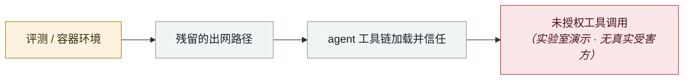

# IDEsaster

IDEsaster

      

## 概要

研究者 **Ari Marzouk（MaccariTA）** 六个月调查，30+ 漏洞，**受测的 AI IDE 与编码助手 100% 存在问题**，至少 **24 个 CVE** + AWS 额外公告。覆盖 GitHub Copilot、Cursor、Windsurf、Kiro.dev、Zed.dev、Roo Code、Junie、Cline、Gemini CLI、Claude Code。统一模式：把载荷放进 AI 会读的文件（仓库配置、代码注释、issue 描述、MCP 工具响应），指挥 AI **把 IDE 的合法功能武器化**

## 攻击链

## 来源

| # | 来源 | 链接 |
|---|---|---|
| 1 | THN | <https://thehackernews.com/2025/12/researchers-uncover-30-flaws-in-ai.html> |
| 2 | Tom's Hardware | <https://www.tomshardware.com/tech-industry/cyber-security/researchers-uncover-critical-ai-ide-flaws-exposing-developers-to-data-theft-and-rce> |

## 元数据

| 字段 | 值 |
|---|---|
| 日期 | `2025-12-06`（原文：2025-12-06，精度 `day`） |
| 性质 | 研究演示 `research` |
| 类型 | [`SANDBOX`](../../../../taxonomy/types.md#sandbox) 沙箱逃逸 · [`MCP`](../../../../taxonomy/types.md#mcp) MCP / 工具链 |
| 严重度 | **中** `medium` |
| 可信度 | **A** — 一手来源（厂商 / 受害方 / 执法 / 官方报告） |
| 真实伤害 | 否 |
| AI 参与 | 已确认 `confirmed` |
| 地区 | [全球](../../../../regions/global.md) |
| 档案编号 | `2025-12-06-idesaster` |

**判定依据**：研究机构或厂商的受控演示，`real_harm: false`；收录是为了标记攻击面何时被公开。 判 `medium`：受控演示、中等缺陷，或单用户 / 单机范围的事故。 分级口径见 [taxonomy/severity.md](../../../../taxonomy/severity.md) 与 [taxonomy/confidence.md](../../../../taxonomy/confidence.md)。

## 相关

**所属专题**：[前沿模型自主越界](../../../../topics/eval-escapes.md) · [agent 供应链投毒](../../../../topics/agent-supply-chain.md)

**同类条目**：

- `2025-12-01` [MCP TypeScript SDK DNS 重绑定](../../../2025-12/2025-12-01-mcp-typescript-sdk-dns.md)   MCP TypeScript SDK DNS rebinding
- `2025-12-01` [Anthropic Git MCP Server 三连 CVE](../../../2025-12/2025-12-01-anthropic-git-mcp-server.md)   Three CVEs in Anthropic's Git MCP Server
- `2026-01-14` [Cursor 白名单绕过 CVE-2026-22708](../../../2026-01/2026-01-14-cursor-bai-ming-dan-rao.md)   Cursor allowlist bypass CVE-2026-22708
- `2025-10-22` [Shadow Escape：首个经 MCP 的零点击 agent 攻击](../../../2025-10/2025-10-22-shadow-escape-mcp-agent.md)   Shadow Escape: first zero-click agent attack over MCP

---

[← English original](../../../2025-12/2025-12-06-idesaster.md) · [2025-12 index](../../../2025-12/README.md) · [All records](../../../README.md) · [Home](../../../../README.md)

本条目属于 **Orca AI Incident Archive**，按 [CC BY 4.0](../../../../LICENSE) 授权。发现事实错误或缺少来源，请[提 issue 或 PR](../../../../CONTRIBUTING.md)——更正会写进条目的修订记录，不会静默覆盖。
