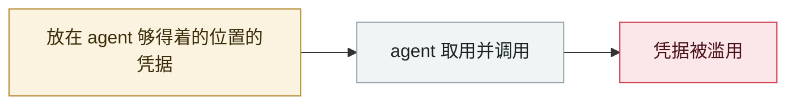

# Chrome 扩展窃取 ChatGPT/DeepSeek 对话

Chrome extensions steal ChatGPT and DeepSeek conversations

     

## 概要

ox.security：约 90 万用户；与 12-15 事件合计约 **890 万用户**受影响

## 攻击链

## 来源

| # | 来源 | 链接 |
|---|---|---|
| 1 | ox.security | <https://www.ox.security/blog/malicious-chrome-extensions-steal-chatgpt-deepseek-conversations/> |

## 元数据

| 字段 | 值 |
|---|---|
| 日期 | `2025-12-30`（原文：2025-12-30，精度 `day`） |
| 性质 | 真实事故 `incident` |
| 类型 | [`CRED`](../../../../taxonomy/types.md#cred) 凭据滥用 |
| 严重度 | **高** `high` |
| 可信度 | **A** — 一手来源（厂商 / 受害方 / 执法 / 官方报告） |
| 真实伤害 | 是 |
| AI 参与 | 已确认 `confirmed` |
| 地区 | [全球](../../../../regions/global.md) |
| 档案编号 | `2025-12-30-chrome-chatgpt-deepseek` |

**判定依据**：真实事故，有确认的受害方。 判 `high`：真实损害范围有限，或属 CVSS 9+ 的严重缺陷，或是有重要意义的能力实证。 分级口径见 [taxonomy/severity.md](../../../../taxonomy/severity.md) 与 [taxonomy/confidence.md](../../../../taxonomy/confidence.md)。

## 相关

**同类条目**：

- `2025-12-15` [「隐私」浏览器扩展倒卖 AI 对话](../../../2025-12/2025-12-15-yin-si-liu-lan-qi.md)   "Privacy" browser extensions resell AI conversations
- `2025-11-21` [Shai-Hulud 2.0](../../../2025-11/2025-11-21-shai-hulud.md)   Shai-Hulud 2.0
- `2026-01-31` [Moltbook 数据库全开](../../../2026-01/2026-01-31-moltbook-open-database.md)   Moltbook database fully open
- `2025-11-25` [OpenAI 通报 Mixpanel 第三方泄露](../../../2025-11/2025-11-25-mixpanel-tong-bao-di-san.md)   OpenAI reports the third-party Mixpanel breach

---

[← English original](../../../2025-12/2025-12-30-chrome-chatgpt-deepseek.md) · [2025-12 index](../../../2025-12/README.md) · [All records](../../../README.md) · [Home](../../../../README.md)

本条目属于 **Orca AI Incident Archive**，按 [CC BY 4.0](../../../../LICENSE) 授权。发现事实错误或缺少来源，请[提 issue 或 PR](../../../../CONTRIBUTING.md)——更正会写进条目的修订记录，不会静默覆盖。
