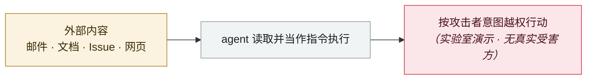

# 九天内四款生产力工具「致命三元组」集中披露

Four productivity tools hit the lethal trifecta in nine days

     

## 概要

四款产品为 **IBM Bob、Superhuman AI、Notion AI、Anthropic Claude Cowork**，攻击模式完全一致：私有数据 + 不可信内容 + 外发能力。**均非概念验证，而是针对财富 500 强、医疗机构与政府承包商在用产品的实战利用**；共同特征是**数据在用户能够介入之前就已被带走**

⚠️ 其中 Superhuman 与 Cowork 在本表中另有独立条目，**入库时勿重复计数**

## 攻击链

## 来源

| # | 来源 | 链接 |
|---|---|---|
| 1 | breached.company | <https://breached.company/the-lethal-trifecta-strikes-four-major-ai-agent-vulnerabilities-in-five-days/> |

## 元数据

| 字段 | 值 |
|---|---|
| 日期 | `2026-01-07` → `2026-01-15`（原文：2026-01-07→15，精度 `day`） |
| 性质 | 研究演示 `research` |
| 类型 | [`IPI`](../../../../taxonomy/types.md#ipi) 间接提示注入 |
| 严重度 | **中** `medium` |
| 可信度 | **B** — 研究机构或主流媒体，有可核查细节 |
| 真实伤害 | 否 |
| AI 参与 | 已确认 `confirmed` |
| 地区 | [全球](../../../../regions/global.md) |
| 档案编号 | `2026-01-07-lethal-trifecta-four-tools` |

**判定依据**：研究机构或厂商的受控演示，`real_harm: false`；收录是为了标记攻击面何时被公开。 判 `medium`：受控演示、中等缺陷，或单用户 / 单机范围的事故。 分级口径见 [taxonomy/severity.md](../../../../taxonomy/severity.md) 与 [taxonomy/confidence.md](../../../../taxonomy/confidence.md)。

## 相关

**所属专题**：[零点击数据外泄链](../../../../topics/zero-click-exfil.md)

**同类条目**：

- `2026-01-12` [Claude Cowork 带着已知漏洞发布](../../../2026-01/2026-01-12-claude-cowork-dai-zhe-zhi.md)   Claude Cowork ships with known vulnerabilities
- `2026-01-12` [Superhuman AI 间接提示注入](../../../2026-01/2026-01-12-superhuman-jian-jie-ti-shi.md)   Superhuman AI indirect prompt injection
- `2026-01-14` [Microsoft Copilot Personal「Reprompt」](../../../2026-01/2026-01-14-microsoft-copilot-personal-reprompt.md)   Microsoft Copilot Personal "Reprompt"
- `2026-02-09` [Clinejection](../../../2026-02/2026-02-09-clinejection.md)   Clinejection

---

[← English original](../../../2026-01/2026-01-07-lethal-trifecta-four-tools.md) · [2026-01 index](../../../2026-01/README.md) · [All records](../../../README.md) · [Home](../../../../README.md)

本条目属于 **Orca AI Incident Archive**，按 [CC BY 4.0](../../../../LICENSE) 授权。发现事实错误或缺少来源，请[提 issue 或 PR](../../../../CONTRIBUTING.md)——更正会写进条目的修订记录，不会静默覆盖。
