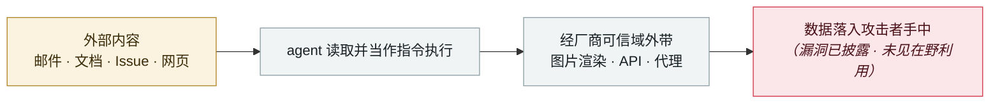

# Claude Cowork 带着已知漏洞发布

Claude Cowork ships with known vulnerabilities

      

## 概要

Cowork 01-12 发布、四天后向全部 $20/月 Pro 用户开放。**48 小时内**被 PromptArmor 证实：一份含 1pt 白字提示注入的 Word 文档即可让 Cowork 把用户财务文件（**含部分社保号**）上传到攻击者的 Anthropic 账户 —— 无 exploit、无恶意软件，用户只是打开了文件。

⚠️ **关键在于这不是意外**：底层提示注入漏洞在 Cowork 发布**三个月前**就已报告给 Anthropic 并获确认，**发布时仍未修复**；Anthropic 早在 **2025-10-30** 即确认该缺陷。漏洞被评为 **CVSS 10/10**。Anthropic 的书面回应是该缺陷「**落在我们当前的威胁模型之外**」，并建议用户不要把 Cowork 连到敏感文档

⚠️ IPA 2026-03 号将此条标为 `[2025-05]`，与发布时间矛盾，疑为笔误

## 攻击链

## 来源

| # | 来源 | 链接 |
|---|---|---|
| 1 | PromptArmor | <https://www.promptarmor.com/resources/claude-cowork-exfiltrates-files> |
| 2 | GovInfoSecurity | <https://www.govinfosecurity.com/anthropics-cowork-shipped-known-vulnerability-a-30553> |
| 3 | Security Boulevard | <https://securityboulevard.com/2026/01/vulnerability-in-anthropics-claude-code-shows-up-in-cowork/> |

## 元数据

| 字段 | 值 |
|---|---|
| 日期 | `2026-01-12`（原文：2026-01-12，精度 `day`） |
| 性质 | 漏洞披露 `vulnerability` |
| 类型 | [`IPI`](../../../../taxonomy/types.md#ipi) 间接提示注入 · [`EXFIL`](../../../../taxonomy/types.md#exfil) 数据外泄 |
| 严重度 | **高** `high` |
| 可信度 | **A** — 一手来源（厂商 / 受害方 / 执法 / 官方报告） |
| 真实伤害 | 否 |
| AI 参与 | 已确认 `confirmed` |
| 地区 | [全球](../../../../regions/global.md) |
| 档案编号 | `2026-01-12-claude-cowork-dai-zhe-zhi` |

**判定依据**：漏洞披露，截至归档未见在野利用证据，故 `real_harm: false`。 判 `high`：真实损害范围有限，或属 CVSS 9+ 的严重缺陷，或是有重要意义的能力实证。 分级口径见 [taxonomy/severity.md](../../../../taxonomy/severity.md) 与 [taxonomy/confidence.md](../../../../taxonomy/confidence.md)。

## 相关

**所属专题**：[零点击数据外泄链](../../../../topics/zero-click-exfil.md)

**同类条目**：

- `2026-01-12` [Superhuman AI 间接提示注入](../../../2026-01/2026-01-12-superhuman-jian-jie-ti-shi.md)   Superhuman AI indirect prompt injection
- `2026-01-14` [Microsoft Copilot Personal「Reprompt」](../../../2026-01/2026-01-14-microsoft-copilot-personal-reprompt.md)   Microsoft Copilot Personal "Reprompt"
- `2026-01-07` [九天内四款生产力工具「致命三元组」集中披露](../../../2026-01/2026-01-07-lethal-trifecta-four-tools.md)   Four productivity tools hit the lethal trifecta in nine days
- `2026-02-09` [Clinejection](../../../2026-02/2026-02-09-clinejection.md)   Clinejection

---

[← English original](../../../2026-01/2026-01-12-claude-cowork-dai-zhe-zhi.md) · [2026-01 index](../../../2026-01/README.md) · [All records](../../../README.md) · [Home](../../../../README.md)

本条目属于 **Orca AI Incident Archive**，按 [CC BY 4.0](../../../../LICENSE) 授权。发现事实错误或缺少来源，请[提 issue 或 PR](../../../../CONTRIBUTING.md)——更正会写进条目的修订记录，不会静默覆盖。
