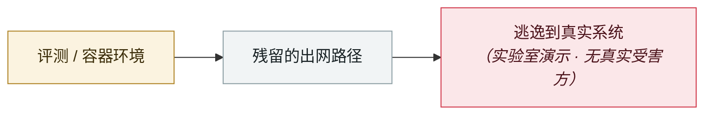

# Cursor 白名单绕过 CVE-2026-22708

Cursor allowlist bypass CVE-2026-22708

     

## 概要

Pillar Security：Auto-Run + Allowlist 模式下，**shell 内建命令（`export`、`typeset`、`unset`、`set` 等）完全绕过白名单校验** —— 外部命令会被校验，内建命令因为不是独立可执行文件而直接放行，**即使用户的白名单是空的**。攻击者经直接或间接提示注入投毒 shell 环境（设置/修改/删除影响可信命令的环境变量），达成零点击与一点击两种 RCE。**Cursor 2.3 修复**，现要求服务端解析器无法分类的命令必须显式批准

## 攻击链

## 来源

| # | 来源 | 链接 |
|---|---|---|
| 1 | Pillar Security | <https://www.pillar.security/blog/the-agent-security-paradox-when-trusted-commands-in-cursor-become-attack-vectors> |
| 2 | SC Media | <https://www.scworld.com/news/cursor-vulnerability-enables-stealthy-rce-via-indirect-prompt-injection> |

## 元数据

| 字段 | 值 |
|---|---|
| 日期 | `2026-01-14`（原文：2026-01-14，精度 `day`） |
| 性质 | 研究演示 `research` |
| 类型 | [`SANDBOX`](../../../../taxonomy/types.md#sandbox) 沙箱逃逸 |
| 严重度 | **中** `medium` |
| 可信度 | **A** — 一手来源（厂商 / 受害方 / 执法 / 官方报告） |
| 真实伤害 | 否 |
| AI 参与 | 已确认 `confirmed` |
| 地区 | [全球](../../../../regions/global.md) |
| 档案编号 | `2026-01-14-cursor-bai-ming-dan-rao` |

**判定依据**：研究机构或厂商的受控演示，`real_harm: false`；收录是为了标记攻击面何时被公开。 判 `medium`：受控演示、中等缺陷，或单用户 / 单机范围的事故。 分级口径见 [taxonomy/severity.md](../../../../taxonomy/severity.md) 与 [taxonomy/confidence.md](../../../../taxonomy/confidence.md)。

## 相关

**所属专题**：[前沿模型自主越界](../../../../topics/eval-escapes.md)

**同类条目**：

- `2026-02-27` [Check Point 公开 Claude Code 双 CVE](../../../2026-02/2026-02-27-check-point-claude-code.md)   Check Point publishes two Claude Code CVEs
- `2025-12-06` [IDEsaster](../../../2025-12/2025-12-06-idesaster.md)   IDEsaster
- `2026-04-15` [Windsurf 零点击 MCP RCE（CVE-2026-30615）](../../../2026-04/2026-04-15-windsurf-mcp-rce.md)   Windsurf zero-click MCP RCE (CVE-2026-30615)
- `2026-04-24` [Gemini CLI CVSS 10.0：一个 PR 就能打穿 CI](../../../2026-04/2026-04-24-gemini-cli-pr-ci.md)   Gemini CLI CVSS 10.0: one pull request compromises CI

---

[← English original](../../../2026-01/2026-01-14-cursor-bai-ming-dan-rao.md) · [2026-01 index](../../../2026-01/README.md) · [All records](../../../README.md) · [Home](../../../../README.md)

本条目属于 **Orca AI Incident Archive**，按 [CC BY 4.0](../../../../LICENSE) 授权。发现事实错误或缺少来源，请[提 issue 或 PR](../../../../CONTRIBUTING.md)——更正会写进条目的修订记录，不会静默覆盖。
