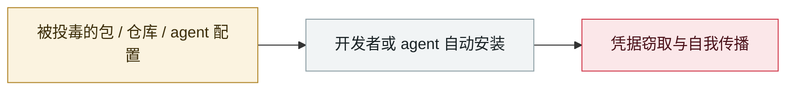

# ClawHub 恶意 skill 激增

Malicious ClawHub skills surge

     

## 概要

4 天内从 28 个涨到 386 个，伪装成加密货币工具

## 攻击链

## 来源

| # | 来源 | 链接 |
|---|---|---|
| 1 | Theori 2026 H1 盘点 | <https://theori.io/ko/blog/2026-h1-hot-security-issue-case> |

## 元数据

| 字段 | 值 |
|---|---|
| 日期 | `2026-01-25`（原文：2026-01-下旬，精度 `part`） |
| 性质 | 真实事故 `incident` |
| 类型 | [`SUPPLY`](../../../../taxonomy/types.md#supply) 供应链投毒 |
| 严重度 | **高** `high` |
| 可信度 | **B** — 研究机构或主流媒体，有可核查细节 |
| 真实伤害 | 是 |
| AI 参与 | 已确认 `confirmed` |
| 地区 | [全球](../../../../regions/global.md) |
| 档案编号 | `2026-01-25-clawhub-skill-e-yi-ji` |

**判定依据**：真实事故，有确认的受害方。 判 `high`：真实损害范围有限，或属 CVSS 9+ 的严重缺陷，或是有重要意义的能力实证。 分级口径见 [taxonomy/severity.md](../../../../taxonomy/severity.md) 与 [taxonomy/confidence.md](../../../../taxonomy/confidence.md)。

## 相关

**所属专题**：[agent 供应链投毒](../../../../topics/agent-supply-chain.md)

**同类条目**：

- `2026-02-09` [Clinejection](../../../2026-02/2026-02-09-clinejection.md)   Clinejection
- `2026-02-01` [ClawHavoc 战役](../../../2026-02/2026-02-01-clawhavoc-zhan-yi.md)   ClawHavoc campaign
- `2025-11-21` [Shai-Hulud 2.0](../../../2025-11/2025-11-21-shai-hulud.md)   Shai-Hulud 2.0
- `2026-03-01` [Hades：把 AI 编码助手本身变成攻击面的持续战役](../../../2026-03/2026-03-01-hades-campaign-ai-coding-assistants.md)   Hades: a sustained campaign turning AI coding assistants into the attack surface

---

[← English original](../../../2026-01/2026-01-25-clawhub-skill-e-yi-ji.md) · [2026-01 index](../../../2026-01/README.md) · [All records](../../../README.md) · [Home](../../../../README.md)

本条目属于 **Orca AI Incident Archive**，按 [CC BY 4.0](../../../../LICENSE) 授权。发现事实错误或缺少来源，请[提 issue 或 PR](../../../../CONTRIBUTING.md)——更正会写进条目的修订记录，不会静默覆盖。
