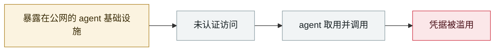

# Clawdbot 网关大规模裸奔

Clawdbot gateways exposed at scale

      

## 概要

反向代理下未正确处理 `X-Forwarded-For`，「localhost 自动批准」误判 → **900+ 实例**可无认证远程访问 Control UI，泄露 Anthropic/Slack/Telegram API key、数月对话历史，并可 **root 权限 RCE**。建议：配置 `gateway.trustedProxies`、启用密码认证、轮换全部凭据

## 攻击链

## 来源

| # | 来源 | 链接 |
|---|---|---|
| 1 | CybersecurityNews | <https://cybersecuritynews.com/clawdbot-chats-exposed/> |
| 2 | 原始发现(X) | <https://x.com/theonejvo/status/2015401219746128322> |

## 元数据

| 字段 | 值 |
|---|---|
| 日期 | `2026-01-26`（原文：2026-01-26，精度 `day`） |
| 性质 | 真实事故 `incident` |
| 类型 | [`INFRA`](../../../../taxonomy/types.md#infra) agent 基础设施暴露 · [`CRED`](../../../../taxonomy/types.md#cred) 凭据滥用 |
| 严重度 | **高** `high` |
| 可信度 | **A** — 一手来源（厂商 / 受害方 / 执法 / 官方报告） |
| 真实伤害 | 是 |
| AI 参与 | 已确认 `confirmed` |
| 地区 | [全球](../../../../regions/global.md) |
| 档案编号 | `2026-01-26-clawdbot-wang-guan-gui-mo` |

**判定依据**：真实事故，有确认的受害方。 判 `high`：真实损害范围有限，或属 CVSS 9+ 的严重缺陷，或是有重要意义的能力实证。 分级口径见 [taxonomy/severity.md](../../../../taxonomy/severity.md) 与 [taxonomy/confidence.md](../../../../taxonomy/confidence.md)。

## 相关

**所属专题**：[agent 基础设施暴露](../../../../topics/agent-infra.md)

**同类条目**：

- `2026-01-31` [Moltbook 数据库全开](../../../2026-01/2026-01-31-moltbook-open-database.md)   Moltbook database fully open
- `2026-01-29` [OpenClaw Control UI WebSocket 劫持 RCE](../../../2026-01/2026-01-29-openclaw-control-ui-websocket.md)   OpenClaw Control UI WebSocket hijack RCE
- `2026-01-31` [Step Finance 金库被盗](../../../2026-01/2026-01-31-step-finance-jin-ku-dao.md)   Step Finance treasury drained
- `2026-02-28` [CodeWall 攻破麦肯锡 "Lilli" 内部 AI 平台](../../../2026-02/2026-02-28-codewall-breaches-mckinsey-lilli.md)   CodeWall breaches McKinsey's internal "Lilli" AI platform

---

[← English original](../../../2026-01/2026-01-26-clawdbot-wang-guan-gui-mo.md) · [2026-01 index](../../../2026-01/README.md) · [All records](../../../README.md) · [Home](../../../../README.md)

本条目属于 **Orca AI Incident Archive**，按 [CC BY 4.0](../../../../LICENSE) 授权。发现事实错误或缺少来源，请[提 issue 或 PR](../../../../CONTRIBUTING.md)——更正会写进条目的修订记录，不会静默覆盖。
