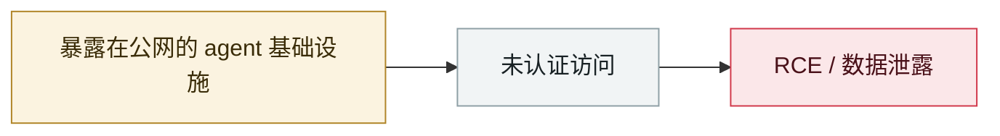

# OpenClaw Control UI WebSocket 劫持 RCE

OpenClaw Control UI WebSocket hijack RCE

     

## 概要

CVE-2026-25253 的前期发现

## 攻击链

## 来源

| # | 来源 | 链接 |
|---|---|---|
| 1 | Permission Protocol tracker | <https://www.permissionprotocol.com/agent-incident-tracker> |

## 元数据

| 字段 | 值 |
|---|---|
| 日期 | `2026-01-29`（原文：2026-01-29，精度 `day`） |
| 性质 | 真实事故 `incident` |
| 类型 | [`INFRA`](../../../../taxonomy/types.md#infra) agent 基础设施暴露 |
| 严重度 | **高** `high` |
| 可信度 | **B** — 研究机构或主流媒体，有可核查细节 |
| 真实伤害 | 否 |
| AI 参与 | 已确认 `confirmed` |
| 地区 | [全球](../../../../regions/global.md) |
| 档案编号 | `2026-01-29-openclaw-control-ui-websocket` |

**判定依据**：真实事故，未见确认的具体受害方。 判 `high`：真实损害范围有限，或属 CVSS 9+ 的严重缺陷，或是有重要意义的能力实证。 分级口径见 [taxonomy/severity.md](../../../../taxonomy/severity.md) 与 [taxonomy/confidence.md](../../../../taxonomy/confidence.md)。

## 相关

**所属专题**：[agent 基础设施暴露](../../../../topics/agent-infra.md)

**同类条目**：

- `2026-01-26` [Clawdbot 网关大规模裸奔](../../../2026-01/2026-01-26-clawdbot-wang-guan-gui-mo.md)   Clawdbot gateways exposed at scale
- `2026-02-28` [CodeWall 攻破麦肯锡 "Lilli" 内部 AI 平台](../../../2026-02/2026-02-28-codewall-breaches-mckinsey-lilli.md)   CodeWall breaches McKinsey's internal "Lilli" AI platform
- `2026-02-10` [15,200 个 OpenClaw 控制面板裸奔](../../../2026-02/2026-02-10-openclaw-kong-zhi-mian-ban.md)   15,200 OpenClaw control panels exposed
- `2026-02-25` [OpenClaw ClawJacked（CVE-2026-25253）](../../../2026-02/2026-02-25-openclaw-clawjacked.md)   OpenClaw ClawJacked (CVE-2026-25253)

---

[← English original](../../../2026-01/2026-01-29-openclaw-control-ui-websocket.md) · [2026-01 index](../../../2026-01/README.md) · [All records](../../../README.md) · [Home](../../../../README.md)

本条目属于 **Orca AI Incident Archive**，按 [CC BY 4.0](../../../../LICENSE) 授权。发现事实错误或缺少来源，请[提 issue 或 PR](../../../../CONTRIBUTING.md)——更正会写进条目的修订记录，不会静默覆盖。
