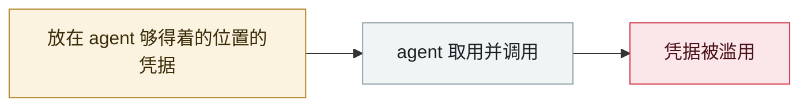

# Moltbook 数据库全开

Moltbook database fully open

     

## 概要

Moltbook（**2026-01-28** 由 Matt Schlicht 上线的「只有 AI agent 能发帖的 Reddit」，最终积累 **170 万注册 agent、近 700 万条评论**）把 **Supabase API key 硬编码在客户端 JS** 里，且 **Row Level Security 从未启用** —— 任何人打开开发者工具即可对生产库无认证读写。Wiz 研究员 **Gal Nagli** 与 Jamieson O'Reilly 独立发现。暴露 **约 150 万个 API 认证 token、3.5 万个邮箱、4,000 条私信**。修复只需两行 SQL

## 攻击链

## 来源

| # | 来源 | 链接 |
|---|---|---|
| 1 | Wiz | <https://www.wiz.io/blog/exposed-moltbook-database-reveals-millions-of-api-keys> |
| 2 | Implicator | <https://www.implicator.ai/moltbook-left-every-ai-agents-api-keys-in-an-open-database-security-researcher-finds/> |

## 元数据

| 字段 | 值 |
|---|---|
| 日期 | `2026-01-31`（原文：2026-01-31，精度 `day`） |
| 性质 | 真实事故 `incident` |
| 类型 | [`CRED`](../../../../taxonomy/types.md#cred) 凭据滥用 |
| 严重度 | **严重** `critical` |
| 可信度 | **A** — 一手来源（厂商 / 受害方 / 执法 / 官方报告） |
| 真实伤害 | 是 |
| AI 参与 | 已确认 `confirmed` |
| 地区 | [全球](../../../../regions/global.md) |
| 档案编号 | `2026-01-31-moltbook-open-database` |

**判定依据**：真实事故，有确认的受害方。 判 `critical`：确认的真实损害达到多组织 / 政府 / 关键基础设施 / 供应链蠕虫级别，或属首次出现且有真实受害方的能力里程碑。 分级口径见 [taxonomy/severity.md](../../../../taxonomy/severity.md) 与 [taxonomy/confidence.md](../../../../taxonomy/confidence.md)。

## 相关

**同类条目**：

- `2026-01-26` [Clawdbot 网关大规模裸奔](../../../2026-01/2026-01-26-clawdbot-wang-guan-gui-mo.md)   Clawdbot gateways exposed at scale
- `2026-01-31` [Step Finance 金库被盗](../../../2026-01/2026-01-31-step-finance-jin-ku-dao.md)   Step Finance treasury drained
- `2025-12-15` [「隐私」浏览器扩展倒卖 AI 对话](../../../2025-12/2025-12-15-yin-si-liu-lan-qi.md)   "Privacy" browser extensions resell AI conversations
- `2025-12-30` [Chrome 扩展窃取 ChatGPT/DeepSeek 对话](../../../2025-12/2025-12-30-chrome-chatgpt-deepseek.md)   Chrome extensions steal ChatGPT and DeepSeek conversations

---

[← English original](../../../2026-01/2026-01-31-moltbook-open-database.md) · [2026-01 index](../../../2026-01/README.md) · [All records](../../../README.md) · [Home](../../../../README.md)

本条目属于 **Orca AI Incident Archive**，按 [CC BY 4.0](../../../../LICENSE) 授权。发现事实错误或缺少来源，请[提 issue 或 PR](../../../../CONTRIBUTING.md)——更正会写进条目的修订记录，不会静默覆盖。
