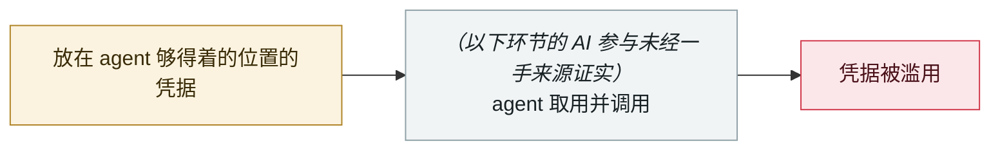

# Step Finance 金库被盗

Step Finance treasury drained

     

> [!WARNING]
> **本条存在争议或未完全证实的事实**，正文中的各方说法并列保留，请勿单独引用其中一方。
> **AI 的参与未获一手来源证实** —— 收录于此是为了让「被广泛传为 AI 事故、实则未经证实」的条目可被检索到，而不是为了佐证它。
> **可信度 D** —— 关键事实或归因存在争议。

## 概要

Solana DeFi 平台 Step Finance 披露安全事故：攻击者取得高管设备访问权后转移了金库钱包的质押授权，**261,854 SOL（约 $27–30M）**被解除质押并转出。代币暴跌近 97%，项目 2026-02 关停，仅追回约 $470 万。

⚠️ **CoinDesk 明确写「未说明攻击者如何取得访问权」，全文无 AI**。「AI 交易 agent 拥有免审批大额转账权限」这一说法**仅见于 AI 营销博客，无一手源支持**。**建议：要么剔除，要么标注为「AI 关联未经证实」**

> [!NOTE]
> CoinDesk 的一手报道全文没有提到 AI。本条保留在库内，是为了让「被二手渠道传成 AI 事故」这件事可被检索与反驳，不是为了佐证它。

## 攻击链

## 来源

| # | 来源 | 链接 |
|---|---|---|
| 1 | CoinDesk | <https://www.coindesk.com/business/2026/01/31/solana-based-defi-platform-step-finance-hit-by-usd30-million-treasury-hack-as-token-price-craters> |
| 2 | Halborn | <https://www.halborn.com/blog/post/explained-the-step-finance-hack-january-2026> |

## 元数据

| 字段 | 值 |
|---|---|
| 日期 | `2026-01-31`（原文：2026-01-31，精度 `day`） |
| 性质 | 真实事故 `incident` |
| 类型 | [`CRED`](../../../../taxonomy/types.md#cred) 凭据滥用 |
| 严重度 | **高** `high` |
| 可信度 | **D** — 关键事实或归因存在争议 |
| 真实伤害 | 是 |
| AI 参与 | 未证实 `unverified` |
| 地区 | [全球](../../../../regions/global.md) |
| 档案编号 | `2026-01-31-step-finance-jin-ku-dao` |

**判定依据**：真实事故，有确认的受害方。 判 `high`：真实损害范围有限，或属 CVSS 9+ 的严重缺陷，或是有重要意义的能力实证。 分级口径见 [taxonomy/severity.md](../../../../taxonomy/severity.md) 与 [taxonomy/confidence.md](../../../../taxonomy/confidence.md)。

## 相关

**同类条目**：

- `2026-01-31` [Moltbook 数据库全开](../../../2026-01/2026-01-31-moltbook-open-database.md)   Moltbook database fully open
- `2026-01-26` [Clawdbot 网关大规模裸奔](../../../2026-01/2026-01-26-clawdbot-wang-guan-gui-mo.md)   Clawdbot gateways exposed at scale
- `2025-12-15` [「隐私」浏览器扩展倒卖 AI 对话](../../../2025-12/2025-12-15-yin-si-liu-lan-qi.md)   "Privacy" browser extensions resell AI conversations
- `2025-12-30` [Chrome 扩展窃取 ChatGPT/DeepSeek 对话](../../../2025-12/2025-12-30-chrome-chatgpt-deepseek.md)   Chrome extensions steal ChatGPT and DeepSeek conversations

---

[← English original](../../../2026-01/2026-01-31-step-finance-jin-ku-dao.md) · [2026-01 index](../../../2026-01/README.md) · [All records](../../../README.md) · [Home](../../../../README.md)

本条目属于 **Orca AI Incident Archive**，按 [CC BY 4.0](../../../../LICENSE) 授权。发现事实错误或缺少来源，请[提 issue 或 PR](../../../../CONTRIBUTING.md)——更正会写进条目的修订记录，不会静默覆盖。
