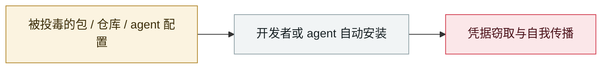

# ClawHavoc 战役

ClawHavoc campaign

     

## 概要

Koi Security 审计 ClawHub 上 **2,857 个 skill，发现 341 个恶意（约 12%）**，后续统计升至 **824 个**。主载荷为 macOS 信息窃取器 **AMOS (Atomic Stealer)**。手法：typosquatting、伪造「前置条件」要求、反弹 shell、读 `.env`；载荷藏在密码保护压缩包与混淆 shell 脚本里以躲静态分析。OpenClaw 随后与 VirusTotal 合作，对所有 skill 接入自动扫描（含基于 LLM 的 Code Insight）

⚠️ **恶意数量来源冲突：341 / 824 / 1,184 / 1,200+，取决于审计时点与口径**

## 攻击链

## 来源

| # | 来源 | 链接 |
|---|---|---|
| 1 | Koi Security | <https://www.koi.ai/blog/clawhavoc-341-malicious-clawedbot-skills-found-by-the-bot-they-were-targeting> |
| 2 | OpenClaw 公告 | <https://openclaw.ai/blog/virustotal-partnership> |

## 元数据

| 字段 | 值 |
|---|---|
| 日期 | `2026-02-01`（原文：2026-02-01，精度 `day`） |
| 性质 | 真实事故 `incident` |
| 类型 | [`SUPPLY`](../../../../taxonomy/types.md#supply) 供应链投毒 |
| 严重度 | **高** `high` |
| 可信度 | **A** — 一手来源（厂商 / 受害方 / 执法 / 官方报告） |
| 真实伤害 | 是 |
| AI 参与 | 已确认 `confirmed` |
| 地区 | [全球](../../../../regions/global.md) |
| 档案编号 | `2026-02-01-clawhavoc-zhan-yi` |

**判定依据**：真实事故，有确认的受害方。 判 `high`：真实损害范围有限，或属 CVSS 9+ 的严重缺陷，或是有重要意义的能力实证。 分级口径见 [taxonomy/severity.md](../../../../taxonomy/severity.md) 与 [taxonomy/confidence.md](../../../../taxonomy/confidence.md)。

## 相关

**所属专题**：[agent 供应链投毒](../../../../topics/agent-supply-chain.md)

**同类条目**：

- `2026-02-09` [Clinejection](../../../2026-02/2026-02-09-clinejection.md)   Clinejection
- `2026-03-01` [Hades：把 AI 编码助手本身变成攻击面的持续战役](../../../2026-03/2026-03-01-hades-campaign-ai-coding-assistants.md)   Hades: a sustained campaign turning AI coding assistants into the attack surface
- `2026-03-24` [LiteLLM 后门版本](../../../2026-03/2026-03-24-litellm-backdoored-release.md)   Backdoored LiteLLM release
- `2026-03-30` [Axios npm 包被攻陷](../../../2026-03/2026-03-30-axios-npm-compromised.md)   Axios npm package compromised

---

[← English original](../../../2026-02/2026-02-01-clawhavoc-zhan-yi.md) · [2026-02 index](../../../2026-02/README.md) · [All records](../../../README.md) · [Home](../../../../README.md)

本条目属于 **Orca AI Incident Archive**，按 [CC BY 4.0](../../../../LICENSE) 授权。发现事实错误或缺少来源，请[提 issue 或 PR](../../../../CONTRIBUTING.md)——更正会写进条目的修订记录，不会静默覆盖。
