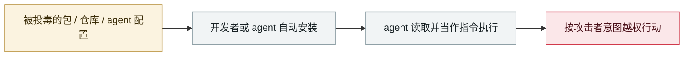

# Clinejection

Clinejection

      

## 概要

**迄今最优雅的 agent 供应链攻击**：在 GitHub issue **标题**里埋提示注入 → 操纵 `claude-code-action` 自动分诊流程 → 任意代码执行 → 污染 GitHub Actions 缓存 → 窃取 `VSCE_PAT` 等发布凭据 → **真的发布了恶意 Cline CLI**。**实际被利用，非 PoC**

## 攻击链

## 来源

| # | 来源 | 链接 |
|---|---|---|
| 1 | adnanthekhan | <https://adnanthekhan.com/posts/clinejection/#pre-publication> |

## 元数据

| 字段 | 值 |
|---|---|
| 日期 | `2026-02-09`（原文：2026-02-09，精度 `day`） |
| 性质 | 真实事故 `incident` |
| 类型 | [`SUPPLY`](../../../../taxonomy/types.md#supply) 供应链投毒 · [`IPI`](../../../../taxonomy/types.md#ipi) 间接提示注入 |
| 严重度 | **严重** `critical` |
| 可信度 | **A** — 一手来源（厂商 / 受害方 / 执法 / 官方报告） |
| 真实伤害 | 是 |
| AI 参与 | 已确认 `confirmed` |
| 地区 | [全球](../../../../regions/global.md) |
| 档案编号 | `2026-02-09-clinejection` |

**判定依据**：真实事故，有确认的受害方。 判 `critical`：确认的真实损害达到多组织 / 政府 / 关键基础设施 / 供应链蠕虫级别，或属首次出现且有真实受害方的能力里程碑。 分级口径见 [taxonomy/severity.md](../../../../taxonomy/severity.md) 与 [taxonomy/confidence.md](../../../../taxonomy/confidence.md)。

## 相关

**所属专题**：[agent 供应链投毒](../../../../topics/agent-supply-chain.md) · [零点击数据外泄链](../../../../topics/zero-click-exfil.md)

**同类条目**：

- `2026-02-01` [ClawHavoc 战役](../../../2026-02/2026-02-01-clawhavoc-zhan-yi.md)   ClawHavoc campaign
- `2026-03-01` [Hades：把 AI 编码助手本身变成攻击面的持续战役](../../../2026-03/2026-03-01-hades-campaign-ai-coding-assistants.md)   Hades: a sustained campaign turning AI coding assistants into the attack surface
- `2026-03-24` [LiteLLM 后门版本](../../../2026-03/2026-03-24-litellm-backdoored-release.md)   Backdoored LiteLLM release
- `2026-03-30` [Axios npm 包被攻陷](../../../2026-03/2026-03-30-axios-npm-compromised.md)   Axios npm package compromised

---

[← English original](../../../2026-02/2026-02-09-clinejection.md) · [2026-02 index](../../../2026-02/README.md) · [All records](../../../README.md) · [Home](../../../../README.md)

本条目属于 **Orca AI Incident Archive**，按 [CC BY 4.0](../../../../LICENSE) 授权。发现事实错误或缺少来源，请[提 issue 或 PR](../../../../CONTRIBUTING.md)——更正会写进条目的修订记录，不会静默覆盖。
