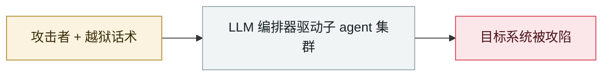

# AI 增强型威胁方批量攻陷 600+ FortiGate

AI-augmented actor compromises 600+ FortiGate devices

     

## 概要

AWS Security：俄语系行为者 **5 周内**攻陷全球 600+ 台 FortiGate。**不用零日**，只扫公开管理端口 + 弱口令。AI 作为「战力倍增器」自动化侦察、开发定制工具、生成攻击计划；使用自研 MCP 框架 **ARXON** 把 LLM 接进入侵工作流（DCSync/Impacket 窃凭据、打 Veeam 备份）。行为者本身技术中等，但 AI 让运营规模大幅放大

## 攻击链

## 来源

| # | 来源 | 链接 |
|---|---|---|
| 1 | AWS Security | <https://aws.amazon.com/jp/blogs/security/ai-augmented-threat-actor-accesses-fortigate-devices-at-scale/> |
| 2 | BleepingComputer | <https://www.bleepingcomputer.com/news/security/amazon-ai-assisted-hacker-breached-600-fortigate-firewalls-in-5-weeks/> |
| 3 | Cyber&Ramen 技术分析 | <https://cyberandramen.net/2026/02/21/llms-in-the-kill-chain-inside-a-custom-mcp-targeting-fortigate-devices-across-continents/> |

## 元数据

| 字段 | 值 |
|---|---|
| 日期 | `2026-02-20`（原文：2026-02-20，精度 `day`） |
| 性质 | 真实事故 `incident` |
| 类型 | [`WEAPON`](../../../../taxonomy/types.md#weapon) agent 被用作攻击工具 |
| 严重度 | **严重** `critical` |
| 可信度 | **A** — 一手来源（厂商 / 受害方 / 执法 / 官方报告） |
| 真实伤害 | 是 |
| AI 参与 | 已确认 `confirmed` |
| 地区 | [全球](../../../../regions/global.md) |
| 档案编号 | `2026-02-20-fortigate-600-devices-compromised` |

**判定依据**：真实事故，有确认的受害方。 判 `critical`：确认的真实损害达到多组织 / 政府 / 关键基础设施 / 供应链蠕虫级别，或属首次出现且有真实受害方的能力里程碑。 分级口径见 [taxonomy/severity.md](../../../../taxonomy/severity.md) 与 [taxonomy/confidence.md](../../../../taxonomy/confidence.md)。

## 相关

**所属专题**：[攻击方 AI 能力演进](../../../../topics/offensive-ai.md)

**同类条目**：

- `2026-02-25` [墨西哥 9 个政府机构被攻陷](../../../2026-02/2026-02-25-mexico-nine-agencies-breached.md)   Nine Mexican government agencies breached
- `2026-02-28` [CodeWall 攻破麦肯锡 "Lilli" 内部 AI 平台](../../../2026-02/2026-02-28-codewall-breaches-mckinsey-lilli.md)   CodeWall breaches McKinsey's internal "Lilli" AI platform
- `2026-01-01` [墨西哥某供水公司 OT 网络被 Claude Code 侦察喷洒](../../../2026-01/2026-01-01-ot-claude-code.md)   Claude Code sprays credentials at a Mexican water utility's OT network
- `2026-03-06` [Microsoft《AI as tradecraft》](../../../2026-03/2026-03-06-microsoft-as-tradecraft.md)   Microsoft, "AI as tradecraft"

---

[← English original](../../../2026-02/2026-02-20-fortigate-600-devices-compromised.md) · [2026-02 index](../../../2026-02/README.md) · [All records](../../../README.md) · [Home](../../../../README.md)

本条目属于 **Orca AI Incident Archive**，按 [CC BY 4.0](../../../../LICENSE) 授权。发现事实错误或缺少来源，请[提 issue 或 PR](../../../../CONTRIBUTING.md)——更正会写进条目的修订记录，不会静默覆盖。
