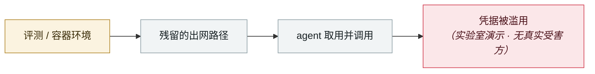

# Check Point 公开 Claude Code 双 CVE

Check Point publishes two Claude Code CVEs

      

> [!WARNING]
> **本条存在争议或未完全证实的事实**，正文中的各方说法并列保留，请勿单独引用其中一方。

## 概要

CVE-2025-59536（启动信任对话框前即可执行命令）+ CVE-2026-21852（`ANTHROPIC_BASE_URL` 重定向窃 API key）。**Anthropic 在公开披露前已全部修复**

⚠️ v1 中「攻击者把 Claude Code 当 C2 用了 18 天」一条查无实据，疑为本条讹传，v2 已删除

## 攻击链

## 来源

| # | 来源 | 链接 |
|---|---|---|
| 1 | Check Point | <https://research.checkpoint.com/2026/rce-and-api-token-exfiltration-through-claude-code-project-files-cve-2025-59536/> |
| 2 | THN | <https://thehackernews.com/2026/02/claude-code-flaws-allow-remote-code.html> |

## 元数据

| 字段 | 值 |
|---|---|
| 日期 | `2026-02-27`（原文：2026-02-27，精度 `day`） |
| 性质 | 研究演示 `research` |
| 类型 | [`SANDBOX`](../../../../taxonomy/types.md#sandbox) 沙箱逃逸 · [`CRED`](../../../../taxonomy/types.md#cred) 凭据滥用 |
| 严重度 | **高** `high` |
| 可信度 | **A** — 一手来源（厂商 / 受害方 / 执法 / 官方报告） |
| 真实伤害 | 否 |
| AI 参与 | 已确认 `confirmed` |
| 地区 | [全球](../../../../regions/global.md) |
| 档案编号 | `2026-02-27-check-point-claude-code` |

**判定依据**：研究机构或厂商的受控演示，`real_harm: false`；收录是为了标记攻击面何时被公开。 判 `high`：真实损害范围有限，或属 CVSS 9+ 的严重缺陷，或是有重要意义的能力实证。 分级口径见 [taxonomy/severity.md](../../../../taxonomy/severity.md) 与 [taxonomy/confidence.md](../../../../taxonomy/confidence.md)。

## 相关

**所属专题**：[前沿模型自主越界](../../../../topics/eval-escapes.md)

**同类条目**：

- `2026-02-01` [信息窃取器开始专门收割 OpenClaw 配置与网关令牌](../../../2026-02/2026-02-01-openclaw-xin-xi-qie-qu.md)   Infostealers start harvesting OpenClaw configs and gateway tokens
- `2026-01-31` [Moltbook 数据库全开](../../../2026-01/2026-01-31-moltbook-open-database.md)   Moltbook database fully open
- `2026-03-01` [Hades：把 AI 编码助手本身变成攻击面的持续战役](../../../2026-03/2026-03-01-hades-campaign-ai-coding-assistants.md)   Hades: a sustained campaign turning AI coding assistants into the attack surface
- `2026-03-24` [LiteLLM 后门版本](../../../2026-03/2026-03-24-litellm-backdoored-release.md)   Backdoored LiteLLM release

---

[← English original](../../../2026-02/2026-02-27-check-point-claude-code.md) · [2026-02 index](../../../2026-02/README.md) · [All records](../../../README.md) · [Home](../../../../README.md)

本条目属于 **Orca AI Incident Archive**，按 [CC BY 4.0](../../../../LICENSE) 授权。发现事实错误或缺少来源，请[提 issue 或 PR](../../../../CONTRIBUTING.md)——更正会写进条目的修订记录，不会静默覆盖。
