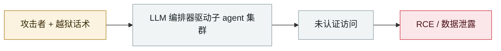

# CodeWall 攻破麦肯锡 "Lilli" 内部 AI 平台

CodeWall breaches McKinsey's internal "Lilli" AI platform

      

## 概要

自主攻击 agent 在公开 API 端点发现**未认证 SQL 注入** → 生产库完整读写权限 → **4,650 万条聊天消息**、机密文档、专有研究数据泄露。更严重的是拿到了 **AI 提示层的写权限**（可操纵回答、禁用护栏）。03-09 公开

## 攻击链

## 来源

| # | 来源 | 链接 |
|---|---|---|
| 1 | CodeWall | <https://codewall.ai/blog/how-we-hacked-mckinseys-ai-platform> |

## 元数据

| 字段 | 值 |
|---|---|
| 日期 | `2026-02-28`（原文：2026-02-28，精度 `day`） |
| 性质 | 真实事故 `incident` |
| 类型 | [`WEAPON`](../../../../taxonomy/types.md#weapon) agent 被用作攻击工具 · [`INFRA`](../../../../taxonomy/types.md#infra) agent 基础设施暴露 |
| 严重度 | **严重** `critical` |
| 可信度 | **A** — 一手来源（厂商 / 受害方 / 执法 / 官方报告） |
| 真实伤害 | 是 |
| AI 参与 | 已确认 `confirmed` |
| 地区 | [美国](../../../../regions/us.md) |
| 档案编号 | `2026-02-28-codewall-breaches-mckinsey-lilli` |

**判定依据**：真实事故，有确认的受害方。 判 `critical`：确认的真实损害达到多组织 / 政府 / 关键基础设施 / 供应链蠕虫级别，或属首次出现且有真实受害方的能力里程碑。 分级口径见 [taxonomy/severity.md](../../../../taxonomy/severity.md) 与 [taxonomy/confidence.md](../../../../taxonomy/confidence.md)。

## 相关

**所属专题**：[攻击方 AI 能力演进](../../../../topics/offensive-ai.md) · [agent 基础设施暴露](../../../../topics/agent-infra.md)

**同类条目**：

- `2026-02-20` [AI 增强型威胁方批量攻陷 600+ FortiGate](../../../2026-02/2026-02-20-fortigate-600-devices-compromised.md)   AI-augmented actor compromises 600+ FortiGate devices
- `2026-02-25` [墨西哥 9 个政府机构被攻陷](../../../2026-02/2026-02-25-mexico-nine-agencies-breached.md)   Nine Mexican government agencies breached
- `2026-02-10` [15,200 个 OpenClaw 控制面板裸奔](../../../2026-02/2026-02-10-openclaw-kong-zhi-mian-ban.md)   15,200 OpenClaw control panels exposed
- `2026-02-25` [OpenClaw ClawJacked（CVE-2026-25253）](../../../2026-02/2026-02-25-openclaw-clawjacked.md)   OpenClaw ClawJacked (CVE-2026-25253)

---

[← English original](../../../2026-02/2026-02-28-codewall-breaches-mckinsey-lilli.md) · [2026-02 index](../../../2026-02/README.md) · [All records](../../../README.md) · [Home](../../../../README.md)

本条目属于 **Orca AI Incident Archive**，按 [CC BY 4.0](../../../../LICENSE) 授权。发现事实错误或缺少来源，请[提 issue 或 PR](../../../../CONTRIBUTING.md)——更正会写进条目的修订记录，不会静默覆盖。
