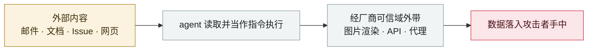

# Claudy Day：claude.ai 三漏洞链

Claudy Day: a three-flaw chain in claude.ai

      

## 概要

Oasis Security 披露的完整攻击流水线，由三个漏洞串成：① claude.ai 上经 **URL 参数**的隐形提示注入 ② 经 **Anthropic Files API** 的数据外带通道 ③ claude.ai 上的**开放重定向**。

投递方式是**买 Google 广告** —— 广告显示的是可信的 claude.com 链接，实际把用户导到被投毒的跳转点，再送进特制的 `claude.ai/new?q=` URL，静默外带用户对话历史中的敏感数据。

⚠️ **最值得注意的一点：不需要任何集成、工具或 MCP server —— 打的是开箱即用的默认 claude.ai 会话**。提示注入部分已修复，其余在处理中

⚠️ v2 曾误置于 2026-05-27，v3 已按 Oasis 披露时间更正

## 攻击链

## 来源

| # | 来源 | 链接 |
|---|---|---|
| 1 | Oasis Security | <https://www.oasis.security/blog/claude-ai-prompt-injection-data-exfiltration-vulnerability> |
| 2 | 技术报告 | <https://www.oasis.security/resources/reports/claude-ai-prompt-injection-vulnerability-technical-report> |
| 3 | Dark Reading | <https://www.darkreading.com/vulnerabilities-threats/claudy-day-trio-flaws-claude-users-data-theft> |

## 元数据

| 字段 | 值 |
|---|---|
| 日期 | `2026-03-01`（原文：2026-03，精度 `month`） |
| 性质 | 真实事故 `incident` |
| 类型 | [`IPI`](../../../../taxonomy/types.md#ipi) 间接提示注入 · [`EXFIL`](../../../../taxonomy/types.md#exfil) 数据外泄 |
| 严重度 | **高** `high` |
| 可信度 | **A** — 一手来源（厂商 / 受害方 / 执法 / 官方报告） |
| 真实伤害 | 否 |
| AI 参与 | 已确认 `confirmed` |
| 地区 | [全球](../../../../regions/global.md) |
| 档案编号 | `2026-03-01-claudy-day-claude-ai` |

**判定依据**：真实事故，未见确认的具体受害方。 判 `high`：真实损害范围有限，或属 CVSS 9+ 的严重缺陷，或是有重要意义的能力实证。 分级口径见 [taxonomy/severity.md](../../../../taxonomy/severity.md) 与 [taxonomy/confidence.md](../../../../taxonomy/confidence.md)。

## 相关

**所属专题**：[零点击数据外泄链](../../../../topics/zero-click-exfil.md)

**同类条目**：

- `2026-03-16` [AI 表格工具数据外泄（CellShock）](../../../2026-03/2026-03-16-cellshock-biao-ge-gong-ju.md)   CellShock: data exfiltration through an AI spreadsheet tool
- `2026-02-09` [Clinejection](../../../2026-02/2026-02-09-clinejection.md)   Clinejection
- `2026-04-01` [Claude Code GitHub Action 三 CVE：一个 PR 标题偷走 API key](../../../2026-04/2026-04-01-claude-code-github-action.md)   Three CVEs in the Claude Code GitHub Action: a PR title steals your API key
- `2026-04-15` [ShareLeak（CVE-2026-21520）+ PipeLeak](../../../2026-04/2026-04-15-shareleak-pipeleak.md)   ShareLeak (CVE-2026-21520) and PipeLeak

---

[← English original](../../../2026-03/2026-03-01-claudy-day-claude-ai.md) · [2026-03 index](../../../2026-03/README.md) · [All records](../../../README.md) · [Home](../../../../README.md)

本条目属于 **Orca AI Incident Archive**，按 [CC BY 4.0](../../../../LICENSE) 授权。发现事实错误或缺少来源，请[提 issue 或 PR](../../../../CONTRIBUTING.md)——更正会写进条目的修订记录，不会静默覆盖。
