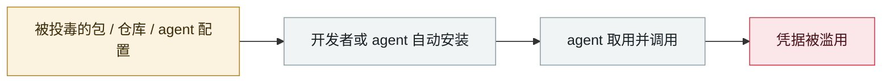

# Hades：把 AI 编码助手本身变成攻击面的持续战役

Hades: a sustained campaign turning AI coding assistants into the attack surface

      

## 概要

至少从 2026-03 持续至今，已从 **6,943 台开发者机器窃取 294,842 个密钥**。手法：恶意 npm/PyPI 包**大量 typosquat MCP 库**（`langchain-core-mcp`、`instructor-mcp`、`openai-mcp`、`tiktoken-mcp`、`ray-mcp-server`），并**针对 14 种不同 AI agent 的规则文件与配置目录**植入自定义提示指令或钩子 —— **当受害者用 AI 助手打开或查阅该工作区时触发 `bun run bootstrap`**。收集 `ANTHROPIC_API_KEY`、Claude Desktop/Claude Code 配置、`.mcp.json`，以及 `.npmrc`/`.pypirc`/SSH 密钥/AWS-GCP-Azure 令牌/K8s secret/GitHub PAT 与 Actions token/Docker 配置/`.env`/shell 历史。窃得的发布凭据用于继续感染更多包，形成蠕虫式自传播。CSO Online 的标题是「**会对 AI 安全 agent 撒谎的恶意软件**」

## 攻击链

## 来源

| # | 来源 | 链接 |
|---|---|---|
| 1 | Orca Security | <https://orca.security/resources/blog/hades-pypi-supply-chain-attack/> |
| 2 | Morphisec | <https://www.morphisec.com/blog/when-your-ai-coding-assistant-becomes-the-attack-the-hades-supply-chain-campaign/> |
| 3 | CSO Online | <https://www.csoonline.com/article/4182707/meet-hades-the-malware-that-lies-to-ai-security-agents-2.html> |

## 元数据

| 字段 | 值 |
|---|---|
| 日期 | `2026-03-01`（原文：2026-03 起，精度 `month`） |
| 性质 | 真实事故 `incident` |
| 类型 | [`SUPPLY`](../../../../taxonomy/types.md#supply) 供应链投毒 · [`CRED`](../../../../taxonomy/types.md#cred) 凭据滥用 |
| 严重度 | **严重** `critical` |
| 可信度 | **A** — 一手来源（厂商 / 受害方 / 执法 / 官方报告） |
| 真实伤害 | 是 |
| AI 参与 | 已确认 `confirmed` |
| 地区 | [全球](../../../../regions/global.md) |
| 档案编号 | `2026-03-01-hades-campaign-ai-coding-assistants` |

**判定依据**：真实事故，有确认的受害方。 判 `critical`：确认的真实损害达到多组织 / 政府 / 关键基础设施 / 供应链蠕虫级别，或属首次出现且有真实受害方的能力里程碑。 分级口径见 [taxonomy/severity.md](../../../../taxonomy/severity.md) 与 [taxonomy/confidence.md](../../../../taxonomy/confidence.md)。

## 相关

**所属专题**：[agent 供应链投毒](../../../../topics/agent-supply-chain.md)

**同类条目**：

- `2026-03-24` [LiteLLM 后门版本](../../../2026-03/2026-03-24-litellm-backdoored-release.md)   Backdoored LiteLLM release
- `2026-03-30` [Axios npm 包被攻陷](../../../2026-03/2026-03-30-axios-npm-compromised.md)   Axios npm package compromised
- `2026-03-02` [Trivy 生态持续性供应链攻陷](../../../2026-03/2026-03-02-trivy-sheng-tai-chi-xu.md)   Sustained supply-chain compromise across the Trivy ecosystem
- `2026-03-26` [Anthropic CMS 配置错误泄露 "Mythos" 存在](../../../2026-03/2026-03-26-anthropic-cms-mythos.md)   Anthropic CMS misconfiguration reveals the existence of "Mythos"

---

[← English original](../../../2026-03/2026-03-01-hades-campaign-ai-coding-assistants.md) · [2026-03 index](../../../2026-03/README.md) · [All records](../../../README.md) · [Home](../../../../README.md)

本条目属于 **Orca AI Incident Archive**，按 [CC BY 4.0](../../../../LICENSE) 授权。发现事实错误或缺少来源，请[提 issue 或 PR](../../../../CONTRIBUTING.md)——更正会写进条目的修订记录，不会静默覆盖。
