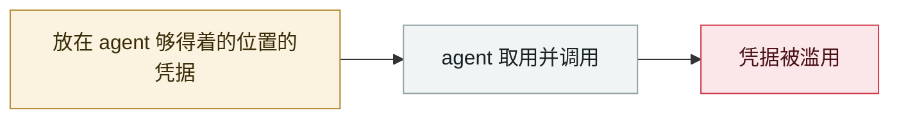

# METR API key 被盗，$60 万额度被消耗

METR API key stolen, $600K of credit burned

     

## 概要

研究员在**个人 EC2** 上跑 agent，用 Google 认证保护，但该 vibe-coded 应用**持有 METR 公共模型账号的 API key**，且认证存在 **fail-open 缺陷**静默失效数日。攻击者**诱导 agent 吐出模型提供方 API key**并加了 SSH 密钥持久化，随后三周消耗价值约 **$600,000** 的额度（由模型厂商免费提供，故为商业价值非直接损失）。因 METR 本身跑大规模评测、token 消耗天然巨大且无上限，故长期未被发现。2026-08-31 披露

## 攻击链

## 来源

| # | 来源 | 链接 |
|---|---|---|
| 1 | METR 官方 | <https://metr.org/blog/2026-08-31-security-update/> |
| 2 | The Register | <https://www.theregister.com/security/2026/09/01/attacker-stole-a-metr-api-key-used-600k-worth-of-credits-and-no-one-noticed-for-weeks/5293730> |

## 元数据

| 字段 | 值 |
|---|---|
| 日期 | `2026-03-01`（原文：2026-03，精度 `month`） |
| 性质 | 真实事故 `incident` |
| 类型 | [`CRED`](../../../../taxonomy/types.md#cred) 凭据滥用 |
| 严重度 | **高** `high` |
| 可信度 | **A** — 一手来源（厂商 / 受害方 / 执法 / 官方报告） |
| 真实伤害 | 是 |
| AI 参与 | 已确认 `confirmed` |
| 地区 | [美国](../../../../regions/us.md) |
| 档案编号 | `2026-03-01-metr-api-key` |

**判定依据**：真实事故，有确认的受害方。 判 `high`：真实损害范围有限，或属 CVSS 9+ 的严重缺陷，或是有重要意义的能力实证。 分级口径见 [taxonomy/severity.md](../../../../taxonomy/severity.md) 与 [taxonomy/confidence.md](../../../../taxonomy/confidence.md)。

## 相关

**同类条目**：

- `2026-03-01` [Hades：把 AI 编码助手本身变成攻击面的持续战役](../../../2026-03/2026-03-01-hades-campaign-ai-coding-assistants.md)   Hades: a sustained campaign turning AI coding assistants into the attack surface
- `2026-03-24` [LiteLLM 后门版本](../../../2026-03/2026-03-24-litellm-backdoored-release.md)   Backdoored LiteLLM release
- `2026-03-26` [Anthropic CMS 配置错误泄露 "Mythos" 存在](../../../2026-03/2026-03-26-anthropic-cms-mythos.md)   Anthropic CMS misconfiguration reveals the existence of "Mythos"
- `2026-03-31` [Anthropic Claude Code 源码泄露](../../../2026-03/2026-03-31-anthropic-claude-code.md)   Anthropic Claude Code source code leak

---

[← English original](../../../2026-03/2026-03-01-metr-api-key.md) · [2026-03 index](../../../2026-03/README.md) · [All records](../../../README.md) · [Home](../../../../README.md)

本条目属于 **Orca AI Incident Archive**，按 [CC BY 4.0](../../../../LICENSE) 授权。发现事实错误或缺少来源，请[提 issue 或 PR](../../../../CONTRIBUTING.md)——更正会写进条目的修订记录，不会静默覆盖。
