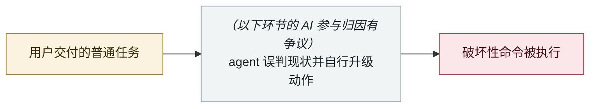

# ⚠️ Amazon 因 AI 生成代码连续宕机

Amazon hit by back-to-back outages from AI-generated code

     

> [!WARNING]
> **本条存在争议或未完全证实的事实**，正文中的各方说法并列保留，请勿单独引用其中一方。
> **AI 的参与存在归因争议**，厂商与报道方说法不一致，详见「元数据」。

## 概要

03-02 Amazon Q 依据**已过期的内部 wiki** 给出错误建议 → 12 万订单丢失、160 万次网站错误；03-05 北美站订单量暴跌 99%，**630 万订单丢失**。Amazon 已强制工程师每周 80% 使用内部 AI 编码助手 Kiro。回应：对约 **335 个 Tier-1 系统**启动 90 天「代码安全重置」，AI 辅助的代码变更须两人评审 + 正式文档审批。**Business Insider 取得内部文件**

## 攻击链

## 来源

| # | 来源 | 链接 |
|---|---|---|
| 1 | Digital Trends | <https://www.digitaltrends.com/computing/ai-code-wreaked-havoc-with-amazon-outage-and-now-the-company-is-making-tight-rules/> |
| 2 | Security Boulevard | <https://securityboulevard.com/2026/03/amazon-lost-6-3-million-orders-to-vibe-coding-your-soc-is-next/> |

## 元数据

| 字段 | 值 |
|---|---|
| 日期 | `2026-03-02`（原文：2026-03-02 / 03-05，精度 `day`） |
| 性质 | 真实事故 `incident` |
| 类型 | [`ROGUE`](../../../../taxonomy/types.md#rogue) agent 自主破坏 |
| 严重度 | **高** `high` |
| 可信度 | **B** — 研究机构或主流媒体，有可核查细节 |
| 真实伤害 | 是 |
| AI 参与 | 有争议 `disputed` |
| 地区 | [美国](../../../../regions/us.md) |
| 档案编号 | `2026-03-02-amazon-yin-sheng-cheng-dai` |

**判定依据**：真实事故，有确认的受害方。 判 `high`：真实损害范围有限，或属 CVSS 9+ 的严重缺陷，或是有重要意义的能力实证。 分级口径见 [taxonomy/severity.md](../../../../taxonomy/severity.md) 与 [taxonomy/confidence.md](../../../../taxonomy/confidence.md)。

## 相关

**所属专题**：[编码 agent 自主破坏](../../../../topics/rogue-agents.md)

**同类条目**：

- `2026-03-18` [Meta 内部 AI agent 数据暴露](../../../2026-03/2026-03-18-meta-agent-nei-bu-shu.md)   Meta internal AI agent data exposure
- `2026-02-26` [Claude Code 用 terraform destroy 抹掉 DataTalks.Club 全部生产基础设施](../../../2026-02/2026-02-26-claude-code-terraform-destroy-datatalks.md)   Claude Code runs terraform destroy on all of DataTalks.Club's production
- `2026-04-25` [Cursor + Claude Opus 4.6 九秒删光生产库与备份](../../../2026-04/2026-04-25-cursor-opus-46-nine-second-wipe.md)   Cursor and Claude Opus 4.6 wipe production and backups in nine seconds
- `2026-02-18` [Microsoft 365 Copilot 越权总结机密邮件](../../../2026-02/2026-02-18-microsoft-copilot-yue-quan-zong.md)   Microsoft 365 Copilot summarises confidential mail it shouldn't see

---

[← English original](../../../2026-03/2026-03-02-amazon-yin-sheng-cheng-dai.md) · [2026-03 index](../../../2026-03/README.md) · [All records](../../../README.md) · [Home](../../../../README.md)

本条目属于 **Orca AI Incident Archive**，按 [CC BY 4.0](../../../../LICENSE) 授权。发现事实错误或缺少来源，请[提 issue 或 PR](../../../../CONTRIBUTING.md)——更正会写进条目的修订记录，不会静默覆盖。
