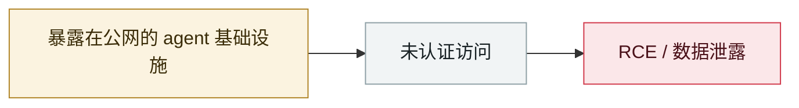

# 麦肯锡 Lilli 事件公开

McKinsey Lilli incident goes public

     

## 概要

见 2026-02-28

## 攻击链

## 来源

| # | 来源 | 链接 |
|---|---|---|
| 1 | CodeWall | <https://codewall.ai/blog/how-we-hacked-mckinseys-ai-platform> |

## 元数据

| 字段 | 值 |
|---|---|
| 日期 | `2026-03-09`（原文：2026-03-09，精度 `day`） |
| 性质 | 真实事故 `incident` |
| 类型 | [`INFRA`](../../../../taxonomy/types.md#infra) agent 基础设施暴露 |
| 严重度 | **高** `high` |
| 可信度 | **A** — 一手来源（厂商 / 受害方 / 执法 / 官方报告） |
| 真实伤害 | 否 |
| AI 参与 | 已确认 `confirmed` |
| 地区 | [美国](../../../../regions/us.md) |
| 档案编号 | `2026-03-09-lilli-mai-ken-xi-shi` |

**判定依据**：真实事故，未见确认的具体受害方。 判 `high`：真实损害范围有限，或属 CVSS 9+ 的严重缺陷，或是有重要意义的能力实证。 分级口径见 [taxonomy/severity.md](../../../../taxonomy/severity.md) 与 [taxonomy/confidence.md](../../../../taxonomy/confidence.md)。

## 相关

**所属专题**：[agent 基础设施暴露](../../../../topics/agent-infra.md)

**同类条目**：

- `2026-03-27` [Langflow 路径穿越任意文件写](../../../2026-03/2026-03-27-langflow-lu-jing-chuan-yue.md)   Langflow path traversal enables arbitrary file write
- `2026-02-28` [CodeWall 攻破麦肯锡 "Lilli" 内部 AI 平台](../../../2026-02/2026-02-28-codewall-breaches-mckinsey-lilli.md)   CodeWall breaches McKinsey's internal "Lilli" AI platform
- `2026-04-16` [MCPwn（CVE-2026-33032）：nginx-ui 的 MCP 端点在野被打](../../../2026-04/2026-04-16-mcpwn-nginx-ui-in-the-wild.md)   MCPwn (CVE-2026-33032): nginx-ui MCP endpoint hit in the wild
- `2026-02-10` [15,200 个 OpenClaw 控制面板裸奔](../../../2026-02/2026-02-10-openclaw-kong-zhi-mian-ban.md)   15,200 OpenClaw control panels exposed

---

[← English original](../../../2026-03/2026-03-09-lilli-mai-ken-xi-shi.md) · [2026-03 index](../../../2026-03/README.md) · [All records](../../../README.md) · [Home](../../../../README.md)

本条目属于 **Orca AI Incident Archive**，按 [CC BY 4.0](../../../../LICENSE) 授权。发现事实错误或缺少来源，请[提 issue 或 PR](../../../../CONTRIBUTING.md)——更正会写进条目的修订记录，不会静默覆盖。
