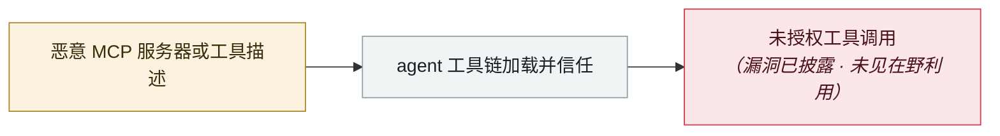

# Azure MCP Server SSRF 提权（CVE-2026-26118）

Azure MCP Server SSRF privilege escalation (CVE-2026-26118)

     

## 概要

**CVSS 8.8**。向接受用户参数的 Azure MCP Server 工具提交一个**恶意 URL 顶替正常的 Azure 资源标识符**，MCP Server 就会向该 URL 发出站请求，**并可能把自己的托管身份令牌一起带上** —— 低权限攻击者由此在无需管理员权限的情况下捕获该令牌并提权

## 攻击链

## 来源

| # | 来源 | 链接 |
|---|---|---|
| 1 | MSRC | <https://msrc.microsoft.com/update-guide/vulnerability/CVE-2026-26118> |
| 2 | NVD | <https://nvd.nist.gov/vuln/detail/CVE-2026-26118> |

## 元数据

| 字段 | 值 |
|---|---|
| 日期 | `2026-03-10`（原文：2026-03-10，精度 `day`） |
| 性质 | 漏洞披露 `vulnerability` |
| 类型 | [`MCP`](../../../../taxonomy/types.md#mcp) MCP / 工具链 |
| 严重度 | **中** `medium` |
| 可信度 | **A** — 一手来源（厂商 / 受害方 / 执法 / 官方报告） |
| 真实伤害 | 否 |
| AI 参与 | 已确认 `confirmed` |
| 地区 | [全球](../../../../regions/global.md) |
| 档案编号 | `2026-03-10-azure-mcp-server-ssrf` |

**判定依据**：漏洞披露，截至归档未见在野利用证据，故 `real_harm: false`。 判 `medium`：受控演示、中等缺陷，或单用户 / 单机范围的事故。 分级口径见 [taxonomy/severity.md](../../../../taxonomy/severity.md) 与 [taxonomy/confidence.md](../../../../taxonomy/confidence.md)。

## 相关

**所属专题**：[agent 供应链投毒](../../../../topics/agent-supply-chain.md)

**同类条目**：

- `2026-04-16` [MCPwn（CVE-2026-33032）：nginx-ui 的 MCP 端点在野被打](../../../2026-04/2026-04-16-mcpwn-nginx-ui-in-the-wild.md)   MCPwn (CVE-2026-33032): nginx-ui MCP endpoint hit in the wild
- `2026-04-15` [Windsurf 零点击 MCP RCE（CVE-2026-30615）](../../../2026-04/2026-04-15-windsurf-mcp-rce.md)   Windsurf zero-click MCP RCE (CVE-2026-30615)
- `2026-05-07` [TrustFall：一次回车即 RCE](../../../2026-05/2026-05-07-trustfall-rce-yi-ci-hui.md)   TrustFall: RCE on a single keypress
- `2026-06-12` [Agentjacking：一个公开 DSN 就能劫持 AI 编码 agent](../../../2026-06/2026-06-12-agentjacking-public-dsn.md)   Agentjacking: one public DSN hijacks AI coding agents

---

[← English original](../../../2026-03/2026-03-10-azure-mcp-server-ssrf.md) · [2026-03 index](../../../2026-03/README.md) · [All records](../../../README.md) · [Home](../../../../README.md)

本条目属于 **Orca AI Incident Archive**，按 [CC BY 4.0](../../../../LICENSE) 授权。发现事实错误或缺少来源，请[提 issue 或 PR](../../../../CONTRIBUTING.md)——更正会写进条目的修订记录，不会静默覆盖。
