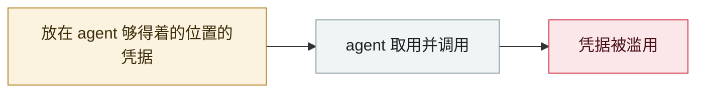

# Anthropic Claude Code 源码泄露

Anthropic Claude Code source code leak

     

## 概要

npm 包中误含 source map（.map），约 **51 万行 TypeScript / 1,906 个文件 / 59.8 MB** 外泄，暴露 KAIROS 自主 agent 模式等未发布功能。随后出现 AI 一天内做出的克隆版，以及混入 **Vidar 窃密器**和 **GhostSocks 代理**的「泄露版源码」

## 攻击链

## 来源

| # | 来源 | 链接 |
|---|---|---|
| 1 | The Register | <https://www.theregister.com/software/2026/03/31/anthropic-accidentally-exposes-claude-code-source-code/5227940> |
| 2 | CNBC | <https://www.cnbc.com/2026/03/31/anthropic-leak-claude-code-internal-source.html> |
| 3 | Zscaler | <https://www.zscaler.com/blogs/security-research/anthropic-claude-code-leak> |

## 元数据

| 字段 | 值 |
|---|---|
| 日期 | `2026-03-31`（原文：2026-03-31，精度 `day`） |
| 性质 | 真实事故 `incident` |
| 类型 | [`CRED`](../../../../taxonomy/types.md#cred) 凭据滥用 |
| 严重度 | **高** `high` |
| 可信度 | **A** — 一手来源（厂商 / 受害方 / 执法 / 官方报告） |
| 真实伤害 | 是 |
| AI 参与 | 已确认 `confirmed` |
| 地区 | [全球](../../../../regions/global.md) |
| 档案编号 | `2026-03-31-anthropic-claude-code` |

**判定依据**：真实事故，有确认的受害方。 判 `high`：真实损害范围有限，或属 CVSS 9+ 的严重缺陷，或是有重要意义的能力实证。 分级口径见 [taxonomy/severity.md](../../../../taxonomy/severity.md) 与 [taxonomy/confidence.md](../../../../taxonomy/confidence.md)。

## 相关

**同类条目**：

- `2026-03-01` [Hades：把 AI 编码助手本身变成攻击面的持续战役](../../../2026-03/2026-03-01-hades-campaign-ai-coding-assistants.md)   Hades: a sustained campaign turning AI coding assistants into the attack surface
- `2026-03-24` [LiteLLM 后门版本](../../../2026-03/2026-03-24-litellm-backdoored-release.md)   Backdoored LiteLLM release
- `2026-03-26` [Anthropic CMS 配置错误泄露 "Mythos" 存在](../../../2026-03/2026-03-26-anthropic-cms-mythos.md)   Anthropic CMS misconfiguration reveals the existence of "Mythos"
- `2026-03-01` [METR API key 被盗，$60 万额度被消耗](../../../2026-03/2026-03-01-metr-api-key.md)   METR API key stolen, $600K of credit burned

---

[← English original](../../../2026-03/2026-03-31-anthropic-claude-code.md) · [2026-03 index](../../../2026-03/README.md) · [All records](../../../README.md) · [Home](../../../../README.md)

本条目属于 **Orca AI Incident Archive**，按 [CC BY 4.0](../../../../LICENSE) 授权。发现事实错误或缺少来源，请[提 issue 或 PR](../../../../CONTRIBUTING.md)——更正会写进条目的修订记录，不会静默覆盖。
