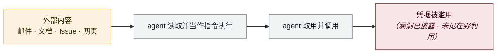

# Claude Code GitHub Action 三 CVE：一个 PR 标题偷走 API key

Three CVEs in the Claude Code GitHub Action: a PR title steals your API key

      

## 概要

**CVE-2026-35020 / 35021 / 35022，CVSS 9.4**。精心构造的 PR 标题即可对跑在 GitHub Actions 里的 Claude Code agent 做提示注入，把 `ANTHROPIC_API_KEY` 外带到攻击者端点。**无需认证、无需仓库权限 —— 开个 PR 就够了**。已确认可外带：`ANTHROPIC_API_KEY`、`GITHUB_TOKEN`、`GEMINI_API_KEY`、`GITHUB_COPILOT_API_TOKEN`、`GITHUB_PERSONAL_ACCESS_TOKEN`。**同一注入向量在 Claude Code、Gemini CLI 与 GitHub Copilot Agent 上均复现成功**。Anthropic 于 **2026-05-05 的 Claude Code 2.1.128** 修复，采用五层控制（工具范围白名单、只读 GITHUB_TOKEN、OIDC 密钥路由、actor 过滤、脚本循环上限）

## 攻击链

## 来源

| # | 来源 | 链接 |
|---|---|---|
| 1 | CSA | <https://labs.cloudsecurityalliance.org/research/csa-research-note-claude-code-github-action-prompt-injection/> |
| 2 | 复现分析 | <https://oddguan.com/blog/comment-and-control-prompt-injection-credential-theft-claude-code-gemini-cli-github-copilot/> |

## 元数据

| 字段 | 值 |
|---|---|
| 日期 | `2026-04-01`（原文：2026-04，精度 `month`） |
| 性质 | 漏洞披露 `vulnerability` |
| 类型 | [`IPI`](../../../../taxonomy/types.md#ipi) 间接提示注入 · [`CRED`](../../../../taxonomy/types.md#cred) 凭据滥用 |
| 严重度 | **高** `high` |
| 可信度 | **A** — 一手来源（厂商 / 受害方 / 执法 / 官方报告） |
| 真实伤害 | 否 |
| AI 参与 | 已确认 `confirmed` |
| 地区 | [全球](../../../../regions/global.md) |
| 档案编号 | `2026-04-01-claude-code-github-action` |

**判定依据**：漏洞披露，截至归档未见在野利用证据，故 `real_harm: false`。 判 `high`：真实损害范围有限，或属 CVSS 9+ 的严重缺陷，或是有重要意义的能力实证。 分级口径见 [taxonomy/severity.md](../../../../taxonomy/severity.md) 与 [taxonomy/confidence.md](../../../../taxonomy/confidence.md)。

## 相关

**所属专题**：[零点击数据外泄链](../../../../topics/zero-click-exfil.md)

**同类条目**：

- `2026-04-15` [ShareLeak（CVE-2026-21520）+ PipeLeak](../../../2026-04/2026-04-15-shareleak-pipeleak.md)   ShareLeak (CVE-2026-21520) and PipeLeak
- `2026-04-19` [Vercel OAuth 供应链入侵](../../../2026-04/2026-04-19-vercel-oauth-gong-ying-lian.md)   Vercel OAuth supply-chain intrusion
- `2026-04-21` [Anthropic "Mythos" 遭未授权访问](../../../2026-04/2026-04-21-anthropic-mythos-zao-shou-quan.md)   Unauthorised access to Anthropic's "Mythos"
- `2026-04-30` [Apple Support App 误发布内部 CLAUDE.md](../../../2026-04/2026-04-30-apple-support-app-claude-md.md)   Apple Support app ships an internal CLAUDE.md by mistake

---

[← English original](../../../2026-04/2026-04-01-claude-code-github-action.md) · [2026-04 index](../../../2026-04/README.md) · [All records](../../../README.md) · [Home](../../../../README.md)

本条目属于 **Orca AI Incident Archive**，按 [CC BY 4.0](../../../../LICENSE) 授权。发现事实错误或缺少来源，请[提 issue 或 PR](../../../../CONTRIBUTING.md)——更正会写进条目的修订记录，不会静默覆盖。
