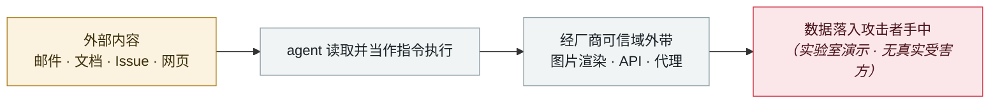

# GrafanaGhost 间接提示注入

GrafanaGhost indirect prompt injection

      

## 概要

Noma Security：经 URL 参数外带遥测、基础设施、客户与财务数据

## 攻击链

## 来源

| # | 来源 | 链接 |
|---|---|---|
| 1 | OWASP Q1'26 | <https://genai.owasp.org/2026/04/14/owasp-genai-exploit-round-up-report-q1-2026/> |

## 元数据

| 字段 | 值 |
|---|---|
| 日期 | `2026-04-07`（原文：2026-04-07，精度 `day`） |
| 性质 | 研究演示 `research` |
| 类型 | [`IPI`](../../../../taxonomy/types.md#ipi) 间接提示注入 · [`EXFIL`](../../../../taxonomy/types.md#exfil) 数据外泄 |
| 严重度 | **中** `medium` |
| 可信度 | **A** — 一手来源（厂商 / 受害方 / 执法 / 官方报告） |
| 真实伤害 | 否 |
| AI 参与 | 已确认 `confirmed` |
| 地区 | [全球](../../../../regions/global.md) |
| 档案编号 | `2026-04-07-grafanaghost-jian-jie-ti-shi` |

**判定依据**：研究机构或厂商的受控演示，`real_harm: false`；收录是为了标记攻击面何时被公开。 判 `medium`：受控演示、中等缺陷，或单用户 / 单机范围的事故。 分级口径见 [taxonomy/severity.md](../../../../taxonomy/severity.md) 与 [taxonomy/confidence.md](../../../../taxonomy/confidence.md)。

## 相关

**所属专题**：[零点击数据外泄链](../../../../topics/zero-click-exfil.md)

**同类条目**：

- `2026-04-01` [Claude Code GitHub Action 三 CVE：一个 PR 标题偷走 API key](../../../2026-04/2026-04-01-claude-code-github-action.md)   Three CVEs in the Claude Code GitHub Action: a PR title steals your API key
- `2026-04-15` [ShareLeak（CVE-2026-21520）+ PipeLeak](../../../2026-04/2026-04-15-shareleak-pipeleak.md)   ShareLeak (CVE-2026-21520) and PipeLeak
- `2026-04-17` [Meta AI 客服机器人被骗交出 Instagram 账号](../../../2026-04/2026-04-17-meta-instagram-ke-fu-ji.md)   Meta AI support bot tricked into handing over an Instagram account
- `2026-03-01` [Claudy Day：claude.ai 三漏洞链](../../../2026-03/2026-03-01-claudy-day-claude-ai.md)   Claudy Day: a three-flaw chain in claude.ai

---

[← English original](../../../2026-04/2026-04-07-grafanaghost-jian-jie-ti-shi.md) · [2026-04 index](../../../2026-04/README.md) · [All records](../../../README.md) · [Home](../../../../README.md)

本条目属于 **Orca AI Incident Archive**，按 [CC BY 4.0](../../../../LICENSE) 授权。发现事实错误或缺少来源，请[提 issue 或 PR](../../../../CONTRIBUTING.md)——更正会写进条目的修订记录，不会静默覆盖。
