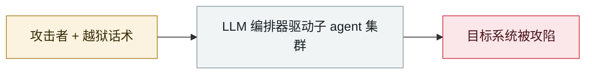

# Aurora 勒索软件用 Cursor Agent 做实战

Aurora ransomware operators use Cursor Agent in live intrusions

     

## 概要

俄语系犯罪团伙（经暴露的基础设施发现）**在 Cursor Agent 中跑 Claude Sonnet**，对 **10 个受害者**协助实施：环境侦察扫描、安装 VPN 客户端、执行证书攻击、打 ESXi。2026-08 公开

## 攻击链

## 来源

| # | 来源 | 链接 |
|---|---|---|
| 1 | THN | <https://thehackernews.com/2026/08/aurora-ransomware-operators-use-cursor.html> |
| 2 | Infosecurity | <https://www.infosecurity-magazine.com/news/abuse-cursor-agent-ransomware/> |
| 3 | CSA | <https://labs.cloudsecurityalliance.org/research/csa-research-note-aurora-ransomware-cursor-ai-abuse-20260901/> |

## 元数据

| 字段 | 值 |
|---|---|
| 日期 | `2026-04-08` → `2026-05-26`（原文：2026-04-08→05-26，精度 `day`） |
| 性质 | 真实事故 `incident` |
| 类型 | [`WEAPON`](../../../../taxonomy/types.md#weapon) agent 被用作攻击工具 |
| 严重度 | **高** `high` |
| 可信度 | **A** — 一手来源（厂商 / 受害方 / 执法 / 官方报告） |
| 真实伤害 | 是 |
| AI 参与 | 已确认 `confirmed` |
| 地区 | [全球](../../../../regions/global.md) |
| 档案编号 | `2026-04-08-aurora-cursor-agent` |

**判定依据**：真实事故，有确认的受害方。 判 `high`：真实损害范围有限，或属 CVSS 9+ 的严重缺陷，或是有重要意义的能力实证。 分级口径见 [taxonomy/severity.md](../../../../taxonomy/severity.md) 与 [taxonomy/confidence.md](../../../../taxonomy/confidence.md)。

## 相关

**所属专题**：[攻击方 AI 能力演进](../../../../topics/offensive-ai.md)

**同类条目**：

- `2026-05-10` [首起在野的「LLM agent 自主完成入侵后全流程」](../../../2026-05/2026-05-10-first-in-wild-autonomous-llm-post-exploitation.md)   First in-the-wild LLM agent running the full post-exploitation chain
- `2026-03-06` [Microsoft《AI as tradecraft》](../../../2026-03/2026-03-06-microsoft-as-tradecraft.md)   Microsoft, "AI as tradecraft"
- `2026-05-12` [GTIG AI 威胁追踪（2026 版）](../../../2026-05/2026-05-12-gtig-wei-xie-zhui-zong.md)   GTIG AI threat tracker, 2026 edition
- `2026-02-20` [AI 增强型威胁方批量攻陷 600+ FortiGate](../../../2026-02/2026-02-20-fortigate-600-devices-compromised.md)   AI-augmented actor compromises 600+ FortiGate devices

---

[← English original](../../../2026-04/2026-04-08-aurora-cursor-agent.md) · [2026-04 index](../../../2026-04/README.md) · [All records](../../../README.md) · [Home](../../../../README.md)

本条目属于 **Orca AI Incident Archive**，按 [CC BY 4.0](../../../../LICENSE) 授权。发现事实错误或缺少来源，请[提 issue 或 PR](../../../../CONTRIBUTING.md)——更正会写进条目的修订记录，不会静默覆盖。
