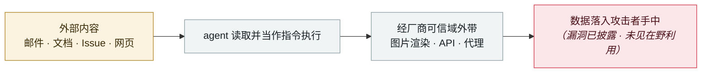

# ShareLeak（CVE-2026-21520）+ PipeLeak

ShareLeak (CVE-2026-21520) and PipeLeak

      

> [!WARNING]
> **本条存在争议或未完全证实的事实**，正文中的各方说法并列保留，请勿单独引用其中一方。

## 概要

**Capsule Security** 发现（**v1 误记为 Zenity、误置于 2026-08**）。ShareLeak：Copilot Studio 把 SharePoint 表单提交内容**未经任何净化**直接与 agent 系统指令拼接，注入的伪 system 角色消息指挥 agent 查询已连接的 SharePoint 列表取 PII/线索/CRM 数据，经 Outlook 发到指定地址。CVSS 7.5，**补丁 2026-01-15 部署**。PipeLeak：Salesforce Agentforce 的同类问题，**Salesforce 未分配 CVE、未发公告**。VentureBeat 指出：**即使安全机制标记了攻击，数据仍然被带走了**

## 攻击链

## 来源

| # | 来源 | 链接 |
|---|---|---|
| 1 | VentureBeat | <https://venturebeat.com/security/microsoft-salesforce-copilot-agentforce-prompt-injection-cve-agent-remediation-playbook> |
| 2 | Capsule Security | <https://www.capsulesecurity.io/blog-post/shareleak-taking-the-wheel-of-microsofts-copilot-studio-cve-2026-21520> |
| 3 | Dark Reading | <https://www.darkreading.com/cloud-security/microsoft-salesforce-patch-ai-agent-data-leak-flaws> |

## 元数据

| 字段 | 值 |
|---|---|
| 日期 | `2026-04-15`（原文：2026-04-15，精度 `day`） |
| 性质 | 漏洞披露 `vulnerability` |
| 类型 | [`IPI`](../../../../taxonomy/types.md#ipi) 间接提示注入 · [`EXFIL`](../../../../taxonomy/types.md#exfil) 数据外泄 |
| 严重度 | **高** `high` |
| 可信度 | **A** — 一手来源（厂商 / 受害方 / 执法 / 官方报告） |
| 真实伤害 | 否 |
| AI 参与 | 已确认 `confirmed` |
| 地区 | [全球](../../../../regions/global.md) |
| 档案编号 | `2026-04-15-shareleak-pipeleak` |

**判定依据**：漏洞披露，截至归档未见在野利用证据，故 `real_harm: false`。 判 `high`：真实损害范围有限，或属 CVSS 9+ 的严重缺陷，或是有重要意义的能力实证。 分级口径见 [taxonomy/severity.md](../../../../taxonomy/severity.md) 与 [taxonomy/confidence.md](../../../../taxonomy/confidence.md)。

## 相关

**所属专题**：[零点击数据外泄链](../../../../topics/zero-click-exfil.md)

**同类条目**：

- `2026-04-01` [Claude Code GitHub Action 三 CVE：一个 PR 标题偷走 API key](../../../2026-04/2026-04-01-claude-code-github-action.md)   Three CVEs in the Claude Code GitHub Action: a PR title steals your API key
- `2026-04-17` [Meta AI 客服机器人被骗交出 Instagram 账号](../../../2026-04/2026-04-17-meta-instagram-ke-fu-ji.md)   Meta AI support bot tricked into handing over an Instagram account
- `2026-04-07` [GrafanaGhost 间接提示注入](../../../2026-04/2026-04-07-grafanaghost-jian-jie-ti-shi.md)   GrafanaGhost indirect prompt injection
- `2026-03-01` [Claudy Day：claude.ai 三漏洞链](../../../2026-03/2026-03-01-claudy-day-claude-ai.md)   Claudy Day: a three-flaw chain in claude.ai

---

[← English original](../../../2026-04/2026-04-15-shareleak-pipeleak.md) · [2026-04 index](../../../2026-04/README.md) · [All records](../../../README.md) · [Home](../../../../README.md)

本条目属于 **Orca AI Incident Archive**，按 [CC BY 4.0](../../../../LICENSE) 授权。发现事实错误或缺少来源，请[提 issue 或 PR](../../../../CONTRIBUTING.md)——更正会写进条目的修订记录，不会静默覆盖。
