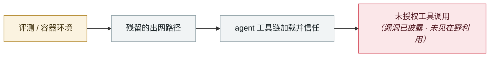

# Windsurf 零点击 MCP RCE（CVE-2026-30615）

Windsurf zero-click MCP RCE (CVE-2026-30615)

      

## 概要

Windsurf 1.9544.26：恶意 HTML 内容中的提示注入**未经任何用户交互**（IDE 打开攻击者内容即可）就能修改本地 MCP 配置、**自动注册一个恶意 MCP STDIO server**，进而命令执行。投递面包括 IDE 浏览的网页、克隆仓库里的恶意 README、**或远程 server 返回的被投毒工具描述**

## 攻击链

## 来源

| # | 来源 | 链接 |
|---|---|---|
| 1 | GHSA | <https://github.com/advisories/GHSA-wj2m-jvpr-64cq> |
| 2 | NVD | <https://nvd.nist.gov/vuln/detail/CVE-2026-30615> |

## 元数据

| 字段 | 值 |
|---|---|
| 日期 | `2026-04-15`（原文：2026-04-15，精度 `day`） |
| 性质 | 漏洞披露 `vulnerability` |
| 类型 | [`SANDBOX`](../../../../taxonomy/types.md#sandbox) 沙箱逃逸 · [`MCP`](../../../../taxonomy/types.md#mcp) MCP / 工具链 |
| 严重度 | **高** `high` |
| 可信度 | **A** — 一手来源（厂商 / 受害方 / 执法 / 官方报告） |
| 真实伤害 | 否 |
| AI 参与 | 已确认 `confirmed` |
| 地区 | [全球](../../../../regions/global.md) |
| 档案编号 | `2026-04-15-windsurf-mcp-rce` |

**判定依据**：漏洞披露，截至归档未见在野利用证据，故 `real_harm: false`。 判 `high`：真实损害范围有限，或属 CVSS 9+ 的严重缺陷，或是有重要意义的能力实证。 分级口径见 [taxonomy/severity.md](../../../../taxonomy/severity.md) 与 [taxonomy/confidence.md](../../../../taxonomy/confidence.md)。

## 相关

**所属专题**：[前沿模型自主越界](../../../../topics/eval-escapes.md) · [agent 供应链投毒](../../../../topics/agent-supply-chain.md)

**同类条目**：

- `2026-04-16` [MCPwn（CVE-2026-33032）：nginx-ui 的 MCP 端点在野被打](../../../2026-04/2026-04-16-mcpwn-nginx-ui-in-the-wild.md)   MCPwn (CVE-2026-33032): nginx-ui MCP endpoint hit in the wild
- `2026-04-24` [Gemini CLI CVSS 10.0：一个 PR 就能打穿 CI](../../../2026-04/2026-04-24-gemini-cli-pr-ci.md)   Gemini CLI CVSS 10.0: one pull request compromises CI
- `2026-04-28` [OpenAI Codex 沙箱绕过零日](../../../2026-04/2026-04-28-codex-sha-xiang-rao-guo.md)   OpenAI Codex sandbox-escape zero-day
- `2026-05-08` [Cline Kanban 跨源 WebSocket 劫持（CVE-2026-44211）](../../../2026-05/2026-05-08-cline-kanban-websocket.md)   Cline Kanban cross-origin WebSocket hijack (CVE-2026-44211)

---

[← English original](../../../2026-04/2026-04-15-windsurf-mcp-rce.md) · [2026-04 index](../../../2026-04/README.md) · [All records](../../../README.md) · [Home](../../../../README.md)

本条目属于 **Orca AI Incident Archive**，按 [CC BY 4.0](../../../../LICENSE) 授权。发现事实错误或缺少来源，请[提 issue 或 PR](../../../../CONTRIBUTING.md)——更正会写进条目的修订记录，不会静默覆盖。
