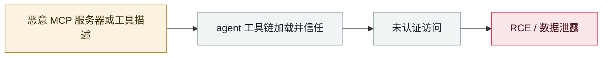

# MCPwn（CVE-2026-33032）：nginx-ui 的 MCP 端点在野被打

MCPwn (CVE-2026-33032): nginx-ui MCP endpoint hit in the wild

      

## 概要

**CVSS 9.8，在野利用**，由 Pluto Security 命名。根因极其朴素：nginx-ui 的 MCP 集成暴露两个端点，`/mcp` 同时经中间件强制 IP 白名单 + 认证，而 **`/mcp_message` 只应用 IP 白名单 —— 而该白名单默认为空，于是中间件放行了所有连接**。未认证远程攻击者由此完全接管被管理的 Nginx 服务器。云上可达实例约 **2,600–2,700 台**，PoC 在披露后公开

## 攻击链

## 来源

| # | 来源 | 链接 |
|---|---|---|
| 1 | THN | <https://thehackernews.com/2026/04/critical-nginx-ui-vulnerability-cve.html> |
| 2 | eSentire | <https://www.esentire.com/security-advisories/nginx-ui-authentication-bypass-vulnerability-cve-2026-33032-exploited> |
| 3 | Picus | <https://www.picussecurity.com/resource/blog/cve-2026-33032-mcpwn-how-a-missing-middleware-call-in-nginx-ui-hands-attackers-full-web-server-takeover> |

## 元数据

| 字段 | 值 |
|---|---|
| 日期 | `2026-04-16`（原文：2026-04-16，精度 `day`） |
| 性质 | 真实事故 `incident` |
| 类型 | [`MCP`](../../../../taxonomy/types.md#mcp) MCP / 工具链 · [`INFRA`](../../../../taxonomy/types.md#infra) agent 基础设施暴露 |
| 严重度 | **严重** `critical` |
| 可信度 | **A** — 一手来源（厂商 / 受害方 / 执法 / 官方报告） |
| 真实伤害 | 是 |
| AI 参与 | 已确认 `confirmed` |
| 地区 | [全球](../../../../regions/global.md) |
| 档案编号 | `2026-04-16-mcpwn-nginx-ui-in-the-wild` |

**判定依据**：真实事故，有确认的受害方。 判 `critical`：确认的真实损害达到多组织 / 政府 / 关键基础设施 / 供应链蠕虫级别，或属首次出现且有真实受害方的能力里程碑。 分级口径见 [taxonomy/severity.md](../../../../taxonomy/severity.md) 与 [taxonomy/confidence.md](../../../../taxonomy/confidence.md)。

## 相关

**所属专题**：[agent 供应链投毒](../../../../topics/agent-supply-chain.md) · [agent 基础设施暴露](../../../../topics/agent-infra.md)

**同类条目**：

- `2026-04-07` [Flowise CVE-2025-59528 在野利用](../../../2026-04/2026-04-07-flowise-ye-li-yong.md)   Flowise CVE-2025-59528 exploited in the wild
- `2026-04-15` [Windsurf 零点击 MCP RCE（CVE-2026-30615）](../../../2026-04/2026-04-15-windsurf-mcp-rce.md)   Windsurf zero-click MCP RCE (CVE-2026-30615)
- `2026-04-23` [OpenClaw「Claw Chain」四漏洞链，24.5 万台服务器暴露](../../../2026-04/2026-04-23-openclaw-claw-chain.md)   OpenClaw "Claw Chain": four chained flaws, 245,000 servers exposed
- `2026-04-01` [Google Vertex AI「Double Agent」权限滥用](../../../2026-04/2026-04-01-google-vertex-double-agent.md)   Google Vertex AI "Double Agent" permission abuse

---

[← English original](../../../2026-04/2026-04-16-mcpwn-nginx-ui-in-the-wild.md) · [2026-04 index](../../../2026-04/README.md) · [All records](../../../README.md) · [Home](../../../../README.md)

本条目属于 **Orca AI Incident Archive**，按 [CC BY 4.0](../../../../LICENSE) 授权。发现事实错误或缺少来源，请[提 issue 或 PR](../../../../CONTRIBUTING.md)——更正会写进条目的修订记录，不会静默覆盖。
