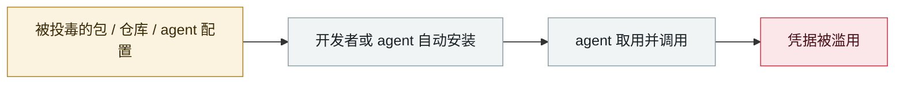

# Vercel OAuth 供应链入侵

Vercel OAuth supply-chain intrusion

      

## 概要

Context.ai 员工中招 **Lumma Stealer** → 攻击者盗走 Vercel 员工授予 Context.ai 的 **Google Workspace OAuth token** → 横移取得 Vercel 的 API key 与数据库连接串。**AI 生态上游被打穿，波及下游部署平台**；OAuth 令牌权限范围过宽是扩大化主因

## 攻击链

## 来源

| # | 来源 | 链接 |
|---|---|---|
| 1 | Vercel 官方 | <https://vercel.com/kb/bulletin/vercel-april-2026-security-incident> |
| 2 | Trend Micro | <https://www.trendmicro.com/en_us/research/26/d/vercel-breach-oauth-supply-chain.html> |

## 元数据

| 字段 | 值 |
|---|---|
| 日期 | `2026-04-19`（原文：2026-04-19，精度 `day`） |
| 性质 | 真实事故 `incident` |
| 类型 | [`SUPPLY`](../../../../taxonomy/types.md#supply) 供应链投毒 · [`CRED`](../../../../taxonomy/types.md#cred) 凭据滥用 |
| 严重度 | **高** `high` |
| 可信度 | **A** — 一手来源（厂商 / 受害方 / 执法 / 官方报告） |
| 真实伤害 | 是 |
| AI 参与 | 已确认 `confirmed` |
| 地区 | [全球](../../../../regions/global.md) |
| 档案编号 | `2026-04-19-vercel-oauth-gong-ying-lian` |

**判定依据**：真实事故，有确认的受害方。 判 `high`：真实损害范围有限，或属 CVSS 9+ 的严重缺陷，或是有重要意义的能力实证。 分级口径见 [taxonomy/severity.md](../../../../taxonomy/severity.md) 与 [taxonomy/confidence.md](../../../../taxonomy/confidence.md)。

## 相关

**所属专题**：[agent 供应链投毒](../../../../topics/agent-supply-chain.md)

**同类条目**：

- `2026-04-01` [Claude Code GitHub Action 三 CVE：一个 PR 标题偷走 API key](../../../2026-04/2026-04-01-claude-code-github-action.md)   Three CVEs in the Claude Code GitHub Action: a PR title steals your API key
- `2026-04-21` [Anthropic "Mythos" 遭未授权访问](../../../2026-04/2026-04-21-anthropic-mythos-zao-shou-quan.md)   Unauthorised access to Anthropic's "Mythos"
- `2026-04-24` [Gemini CLI CVSS 10.0：一个 PR 就能打穿 CI](../../../2026-04/2026-04-24-gemini-cli-pr-ci.md)   Gemini CLI CVSS 10.0: one pull request compromises CI
- `2026-04-30` [Apple Support App 误发布内部 CLAUDE.md](../../../2026-04/2026-04-30-apple-support-app-claude-md.md)   Apple Support app ships an internal CLAUDE.md by mistake

---

[← English original](../../../2026-04/2026-04-19-vercel-oauth-gong-ying-lian.md) · [2026-04 index](../../../2026-04/README.md) · [All records](../../../README.md) · [Home](../../../../README.md)

本条目属于 **Orca AI Incident Archive**，按 [CC BY 4.0](../../../../LICENSE) 授权。发现事实错误或缺少来源，请[提 issue 或 PR](../../../../CONTRIBUTING.md)——更正会写进条目的修订记录，不会静默覆盖。
