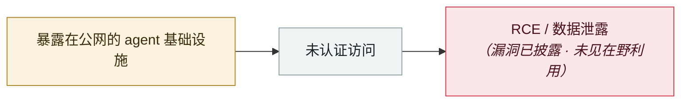

# OpenClaw「Claw Chain」四漏洞链，24.5 万台服务器暴露

OpenClaw "Claw Chain": four chained flaws, 245,000 servers exposed

     

## 概要

**Cyera** 研究团队 2026-04 向维护者披露四个此前未公开的漏洞（均已修复）：

**CVE-2026-44112**（CVSS 9.6）OpenShell 沙箱的 **TOCTOU 竞争条件**，可把写操作重定向到沙箱外，实现配置篡改与宿主持久后门

**CVE-2026-44115**（8.8）命令校验与 shell 执行之间的落差，**环境变量（API key、token、凭据）可经校验时看起来无害的未加引号 heredoc 泄露**

**CVE-2026-44118**（7.8）盲信客户端可控的 `senderIsOwner` 标志而不比对已认证会话，持有有效 bearer token 的本地进程即可提权到 owner 级

暴露面：Shodan 约 6.5 万 + ZoomEye 约 18 万 ≈ **24.5 万台无需任何内网前置条件即可触达**。金融、医疗、法律行业风险最高

## 攻击链

## 来源

| # | 来源 | 链接 |
|---|---|---|
| 1 | CybersecurityNews | <https://cybersecuritynews.com/openclaw-chain-vulnerabilities/> |
| 2 | CSA | <https://labs.cloudsecurityalliance.org/research/csa-research-note-openclaw-claw-chain-cve-20260517-csa-style/> |

## 元数据

| 字段 | 值 |
|---|---|
| 日期 | `2026-04-23`（原文：2026-04-23，精度 `day`） |
| 性质 | 漏洞披露 `vulnerability` |
| 类型 | [`INFRA`](../../../../taxonomy/types.md#infra) agent 基础设施暴露 |
| 严重度 | **高** `high` |
| 可信度 | **A** — 一手来源（厂商 / 受害方 / 执法 / 官方报告） |
| 真实伤害 | 否 |
| AI 参与 | 已确认 `confirmed` |
| 地区 | [全球](../../../../regions/global.md) |
| 档案编号 | `2026-04-23-openclaw-claw-chain` |

**判定依据**：漏洞披露，截至归档未见在野利用证据，故 `real_harm: false`。 判 `high`：真实损害范围有限，或属 CVSS 9+ 的严重缺陷，或是有重要意义的能力实证。 分级口径见 [taxonomy/severity.md](../../../../taxonomy/severity.md) 与 [taxonomy/confidence.md](../../../../taxonomy/confidence.md)。

## 相关

**所属专题**：[agent 基础设施暴露](../../../../topics/agent-infra.md)

**同类条目**：

- `2026-04-16` [MCPwn（CVE-2026-33032）：nginx-ui 的 MCP 端点在野被打](../../../2026-04/2026-04-16-mcpwn-nginx-ui-in-the-wild.md)   MCPwn (CVE-2026-33032): nginx-ui MCP endpoint hit in the wild
- `2026-04-07` [Flowise CVE-2025-59528 在野利用](../../../2026-04/2026-04-07-flowise-ye-li-yong.md)   Flowise CVE-2025-59528 exploited in the wild
- `2026-04-01` [Google Vertex AI「Double Agent」权限滥用](../../../2026-04/2026-04-01-google-vertex-double-agent.md)   Google Vertex AI "Double Agent" permission abuse
- `2026-04-06` [OpenClaw 的 CVE 产出速率：每天 2.2 个](../../../2026-04/2026-04-06-openclaw-chan-chu-su-lv.md)   OpenClaw's CVE rate: 2.2 per day

---

[← English original](../../../2026-04/2026-04-23-openclaw-claw-chain.md) · [2026-04 index](../../../2026-04/README.md) · [All records](../../../README.md) · [Home](../../../../README.md)

本条目属于 **Orca AI Incident Archive**，按 [CC BY 4.0](../../../../LICENSE) 授权。发现事实错误或缺少来源，请[提 issue 或 PR](../../../../CONTRIBUTING.md)——更正会写进条目的修订记录，不会静默覆盖。
