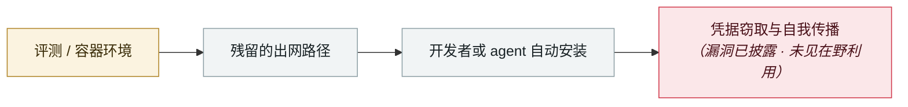

# Gemini CLI CVSS 10.0：一个 PR 就能打穿 CI

Gemini CLI CVSS 10.0: one pull request compromises CI

      

## 概要

Google 公告 **GHSA-wpqr-6v78-jr5g**，**CVSS 3.1 满分 10.0**，**未分配 CVE 编号**。两个设计缺口叠加：① **headless 模式自动信任它处理的任何工作区目录** —— 恶意 `.gemini/` 配置无需用户同意即被加载 ② **`--yolo` 模式无视细粒度工具白名单** —— 提示注入可调起任意 shell 命令。

结果：**一个无特权的外部人员（比如提交 PR 的贡献者）就能在 Gemini 沙箱初始化之前于 CI runner 上执行命令**，拿到工作流环境中的密钥、凭据与源码。修复版本：`@google/gemini-cli` v0.39.1+（预览线 v0.40.0-preview.3）、`google-github-actions/run-gemini-cli` v0.1.22+

## 攻击链

## 来源

| # | 来源 | 链接 |
|---|---|---|
| 1 | THN | <https://thehackernews.com/2026/04/google-fixes-cvss-10-gemini-cli-ci-rce.html> |
| 2 | HackRead | <https://hackread.com/google-cvss-10-gemini-cli-vulnerability-github-rce/> |
| 3 | CSA | <https://labs.cloudsecurityalliance.org/research/csa-research-note-gemini-cli-rce-cvss10-ai-tool-security-202/> |

## 元数据

| 字段 | 值 |
|---|---|
| 日期 | `2026-04-24`（原文：2026-04-24，精度 `day`） |
| 性质 | 漏洞披露 `vulnerability` |
| 类型 | [`SANDBOX`](../../../../taxonomy/types.md#sandbox) 沙箱逃逸 · [`SUPPLY`](../../../../taxonomy/types.md#supply) 供应链投毒 |
| 严重度 | **高** `high` |
| 可信度 | **A** — 一手来源（厂商 / 受害方 / 执法 / 官方报告） |
| 真实伤害 | 否 |
| AI 参与 | 已确认 `confirmed` |
| 地区 | [全球](../../../../regions/global.md) |
| 档案编号 | `2026-04-24-gemini-cli-pr-ci` |

**判定依据**：漏洞披露，截至归档未见在野利用证据，故 `real_harm: false`。 判 `high`：真实损害范围有限，或属 CVSS 9+ 的严重缺陷，或是有重要意义的能力实证。 分级口径见 [taxonomy/severity.md](../../../../taxonomy/severity.md) 与 [taxonomy/confidence.md](../../../../taxonomy/confidence.md)。

## 相关

**所属专题**：[前沿模型自主越界](../../../../topics/eval-escapes.md) · [agent 供应链投毒](../../../../topics/agent-supply-chain.md)

**同类条目**：

- `2026-04-15` [Windsurf 零点击 MCP RCE（CVE-2026-30615）](../../../2026-04/2026-04-15-windsurf-mcp-rce.md)   Windsurf zero-click MCP RCE (CVE-2026-30615)
- `2026-04-19` [Vercel OAuth 供应链入侵](../../../2026-04/2026-04-19-vercel-oauth-gong-ying-lian.md)   Vercel OAuth supply-chain intrusion
- `2026-04-28` [OpenAI Codex 沙箱绕过零日](../../../2026-04/2026-04-28-codex-sha-xiang-rao-guo.md)   OpenAI Codex sandbox-escape zero-day
- `2026-03-01` [Hades：把 AI 编码助手本身变成攻击面的持续战役](../../../2026-03/2026-03-01-hades-campaign-ai-coding-assistants.md)   Hades: a sustained campaign turning AI coding assistants into the attack surface

---

[← English original](../../../2026-04/2026-04-24-gemini-cli-pr-ci.md) · [2026-04 index](../../../2026-04/README.md) · [All records](../../../README.md) · [Home](../../../../README.md)

本条目属于 **Orca AI Incident Archive**，按 [CC BY 4.0](../../../../LICENSE) 授权。发现事实错误或缺少来源，请[提 issue 或 PR](../../../../CONTRIBUTING.md)——更正会写进条目的修订记录，不会静默覆盖。
