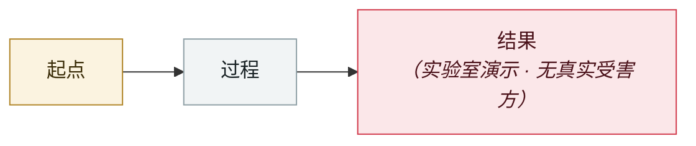

# Linux "Copy Fail" CVE-2026-31431

Linux "Copy Fail" CVE-2026-31431

     

## 概要

与 AI 无直接关系，但属 2026 年「AI 加速漏洞发现」大背景

## 攻击链

## 来源

| # | 来源 | 链接 |
|---|---|---|
| 1 | copy.fail | <https://copy.fail/> |

## 元数据

| 字段 | 值 |
|---|---|
| 日期 | `2026-04-29`（原文：2026-04-29，精度 `day`） |
| 性质 | 研究演示 `research` |
| 类型 | [`OTHER`](../../../../taxonomy/types.md#other) 其他 |
| 严重度 | **低** `low` |
| 可信度 | **A** — 一手来源（厂商 / 受害方 / 执法 / 官方报告） |
| 真实伤害 | 否 |
| AI 参与 | 不适用 `not-applicable` |
| 地区 | [全球](../../../../regions/global.md) |
| 档案编号 | `2026-04-29-linux-copy-fail` |

**判定依据**：研究机构或厂商的受控演示，`real_harm: false`；收录是为了标记攻击面何时被公开。 判 `low`：背景性条目，保留用于时间线连续性。 分级口径见 [taxonomy/severity.md](../../../../taxonomy/severity.md) 与 [taxonomy/confidence.md](../../../../taxonomy/confidence.md)。

---

[← English original](../../../2026-04/2026-04-29-linux-copy-fail.md) · [2026-04 index](../../../2026-04/README.md) · [All records](../../../README.md) · [Home](../../../../README.md)

本条目属于 **Orca AI Incident Archive**，按 [CC BY 4.0](../../../../LICENSE) 授权。发现事实错误或缺少来源，请[提 issue 或 PR](../../../../CONTRIBUTING.md)——更正会写进条目的修订记录，不会静默覆盖。
