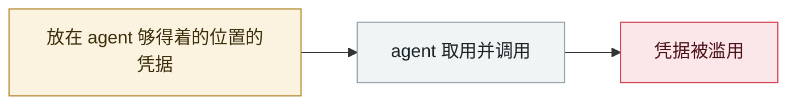

# Apple Support App 误发布内部 CLAUDE.md

Apple Support app ships an internal CLAUDE.md by mistake

     

## 概要

v5.13 生产构建中混入给 Claude Code 用的内部配置文件，泄露 "Juno AI" 设计、Actor 并发模型、UI 组件库等内部架构决策。暴露的是**开发标准与架构决策**而非用户数据，但给了攻击者攻击面地图

## 攻击链

## 来源

| # | 来源 | 链接 |
|---|---|---|
| 1 | 原帖(X) | <https://x.com/aaronp613/status/2049986504617820551> |
| 2 | Medium 分析 | <https://medium.com/vibe-coding/what-apples-leaked-claude-md-teaches-us-b8269e2ace51> |

## 元数据

| 字段 | 值 |
|---|---|
| 日期 | `2026-04-30`（原文：2026-04-30，精度 `day`） |
| 性质 | 真实事故 `incident` |
| 类型 | [`CRED`](../../../../taxonomy/types.md#cred) 凭据滥用 |
| 严重度 | **高** `high` |
| 可信度 | **A** — 一手来源（厂商 / 受害方 / 执法 / 官方报告） |
| 真实伤害 | 是 |
| AI 参与 | 已确认 `confirmed` |
| 地区 | [美国](../../../../regions/us.md) |
| 档案编号 | `2026-04-30-apple-support-app-claude-md` |

**判定依据**：真实事故，有确认的受害方。 判 `high`：真实损害范围有限，或属 CVSS 9+ 的严重缺陷，或是有重要意义的能力实证。 分级口径见 [taxonomy/severity.md](../../../../taxonomy/severity.md) 与 [taxonomy/confidence.md](../../../../taxonomy/confidence.md)。

## 相关

**同类条目**：

- `2026-04-01` [Claude Code GitHub Action 三 CVE：一个 PR 标题偷走 API key](../../../2026-04/2026-04-01-claude-code-github-action.md)   Three CVEs in the Claude Code GitHub Action: a PR title steals your API key
- `2026-04-19` [Vercel OAuth 供应链入侵](../../../2026-04/2026-04-19-vercel-oauth-gong-ying-lian.md)   Vercel OAuth supply-chain intrusion
- `2026-04-21` [Anthropic "Mythos" 遭未授权访问](../../../2026-04/2026-04-21-anthropic-mythos-zao-shou-quan.md)   Unauthorised access to Anthropic's "Mythos"
- `2026-04-17` [Meta AI 客服机器人被骗交出 Instagram 账号](../../../2026-04/2026-04-17-meta-instagram-ke-fu-ji.md)   Meta AI support bot tricked into handing over an Instagram account

---

[← English original](../../../2026-04/2026-04-30-apple-support-app-claude-md.md) · [2026-04 index](../../../2026-04/README.md) · [All records](../../../README.md) · [Home](../../../../README.md)

本条目属于 **Orca AI Incident Archive**，按 [CC BY 4.0](../../../../LICENSE) 授权。发现事实错误或缺少来源，请[提 issue 或 PR](../../../../CONTRIBUTING.md)——更正会写进条目的修订记录，不会静默覆盖。
