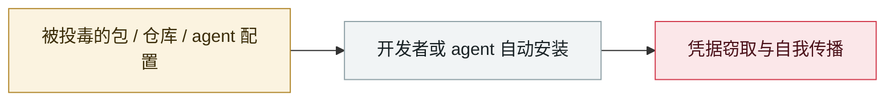

# 假冒 OpenAI 的 Hugging Face 仓库冲上热榜第一

Fake OpenAI repository tops the Hugging Face trending list

     

## 概要

HiddenLayer：仓库 `Open-OSS/privacy-filter` 假冒 OpenAI 的 Privacy Filter 发布，**几乎逐字复制合法 model card** 并配合 typosquatting。**18 小时内冲到 Hugging Face 热榜第 1，累计 244,000+ 次下载、667 个赞**（下载与点赞数评估为自动化刷量）。内藏 `loader.py` 从远程服务器拉 PowerShell 命令静默执行，最终投放 **Rust 编写的信息窃取器**，目标含 Chromium/Firefox 系浏览器、Discord 本地存储、加密钱包、FileZilla 配置与主机信息。HiddenLayer 另发现**另一账号下 6 个使用几乎相同 loader 逻辑、共享基础设施的仓库**

## 攻击链

## 来源

| # | 来源 | 链接 |
|---|---|---|
| 1 | BleepingComputer | <https://www.bleepingcomputer.com/news/security/fake-openai-repository-on-hugging-face-pushes-infostealer-malware/> |
| 2 | CSO Online | <https://www.csoonline.com/article/4169407/malicious-hugging-face-model-masquerading-as-openai-release-hits-244k-downloads.html> |

## 元数据

| 字段 | 值 |
|---|---|
| 日期 | `2026-05-01`（原文：2026-05，精度 `month`） |
| 性质 | 真实事故 `incident` |
| 类型 | [`SUPPLY`](../../../../taxonomy/types.md#supply) 供应链投毒 |
| 严重度 | **高** `high` |
| 可信度 | **A** — 一手来源（厂商 / 受害方 / 执法 / 官方报告） |
| 真实伤害 | 是 |
| AI 参与 | 已确认 `confirmed` |
| 地区 | [全球](../../../../regions/global.md) |
| 档案编号 | `2026-05-01-hugging-face-jia-mao-cang` |

**判定依据**：真实事故，有确认的受害方。 判 `high`：真实损害范围有限，或属 CVSS 9+ 的严重缺陷，或是有重要意义的能力实证。 分级口径见 [taxonomy/severity.md](../../../../taxonomy/severity.md) 与 [taxonomy/confidence.md](../../../../taxonomy/confidence.md)。

## 相关

**所属专题**：[agent 供应链投毒](../../../../topics/agent-supply-chain.md)

**同类条目**：

- `2026-05-19` [TrapDoor：跨三个生态投毒，专门污染 AI 助手配置](../../../2026-05/2026-05-19-trapdoor-poisons-agent-configs.md)   TrapDoor: poisoning three ecosystems to corrupt AI assistant configs
- `2026-05-21` [Composio：agent 自动化本身成了提权路径](../../../2026-05/2026-05-21-composio-agent-automation-privesc.md)   Composio: agent automation itself becomes the privilege-escalation path
- `2026-05-11` [TanStack npm "Mini Shai-Hulud"](../../../2026-05/2026-05-11-tanstack-npm-mini-shai.md)   TanStack npm "Mini Shai-Hulud"
- `2026-05-18` [GitHub 内部 3,800 个仓库被攻陷](../../../2026-05/2026-05-18-github-3800-internal-repos.md)   3,800 internal GitHub repositories compromised

---

[← English original](../../../2026-05/2026-05-01-hugging-face-jia-mao-cang.md) · [2026-05 index](../../../2026-05/README.md) · [All records](../../../README.md) · [Home](../../../../README.md)

本条目属于 **Orca AI Incident Archive**，按 [CC BY 4.0](../../../../LICENSE) 授权。发现事实错误或缺少来源，请[提 issue 或 PR](../../../../CONTRIBUTING.md)——更正会写进条目的修订记录，不会静默覆盖。
