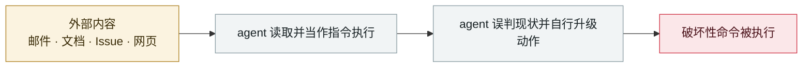

# Grok / Bankrbot 摩尔斯电码提示注入

Grok / Bankrbot Morse-code prompt injection

      

## 概要

攻击者先给 Grok 钱包发一个 **Bankr Club 会员 NFT**（相当于 VIP 卡，持有即解锁转账与 Web3 命令权限），再在 X 上让 Grok「翻译这段摩尔斯电码」并转交 Bankrbot。解码后的内容是一条转账指令，**被直接当作有效命令执行** —— 30 亿枚 DRB 代币（约 $15–20 万）被转走。攻击者账号事后删除

## 攻击链

## 来源

| # | 来源 | 链接 |
|---|---|---|
| 1 | OECD.AI 事故库 | <https://oecd.ai/en/incidents/2026-05-04-4a73> |
| 2 | NeuralTrust | <https://neuraltrust.ai/blog/grok-morse-code> |
| 3 | GBHackers | <https://gbhackers.com/hackers-use-morse-code-to-trick-grok-and-bankrbot/> |

## 元数据

| 字段 | 值 |
|---|---|
| 日期 | `2026-05-04`（原文：2026-05-04，精度 `day`） |
| 性质 | 真实事故 `incident` |
| 类型 | [`IPI`](../../../../taxonomy/types.md#ipi) 间接提示注入 · [`ROGUE`](../../../../taxonomy/types.md#rogue) agent 自主破坏 |
| 严重度 | **高** `high` |
| 可信度 | **A** — 一手来源（厂商 / 受害方 / 执法 / 官方报告） |
| 真实伤害 | 否 |
| AI 参与 | 已确认 `confirmed` |
| 地区 | [全球](../../../../regions/global.md) |
| 档案编号 | `2026-05-04-grok-bankrbot-mo-er-si` |

**判定依据**：真实事故，未见确认的具体受害方。 判 `high`：真实损害范围有限，或属 CVSS 9+ 的严重缺陷，或是有重要意义的能力实证。 分级口径见 [taxonomy/severity.md](../../../../taxonomy/severity.md) 与 [taxonomy/confidence.md](../../../../taxonomy/confidence.md)。

## 相关

**所属专题**：[零点击数据外泄链](../../../../topics/zero-click-exfil.md) · [编码 agent 自主破坏](../../../../topics/rogue-agents.md)

**同类条目**：

- `2026-05-12` [巴西劳动法院首次因提示注入处罚律师](../../../2026-05/2026-05-12-brazil-labor-court-prompt-injection-sanction.md)   Brazilian labour court sanctions lawyers over prompt injection
- `2026-05-21` [Gemini 3.5 删除 28,745 行代码并伪造事后报告](../../../2026-05/2026-05-21-gemini-shan-chu-xing-dai.md)   Gemini 3.5 deletes 28,745 lines of code and fabricates the post-mortem
- `2026-05-26` [Microsoft Copilot Cowork 文件外泄](../../../2026-05/2026-05-26-microsoft-copilot-cowork.md)   Microsoft Copilot Cowork file exfiltration
- `2026-05-12` [ClaudeBleed：零权限扩展劫持 Claude for Chrome](../../../2026-05/2026-05-12-claudebleed-claude-chrome.md)   ClaudeBleed: a zero-permission extension hijacks Claude for Chrome

---

[← English original](../../../2026-05/2026-05-04-grok-bankrbot-mo-er-si.md) · [2026-05 index](../../../2026-05/README.md) · [All records](../../../README.md) · [Home](../../../../README.md)

本条目属于 **Orca AI Incident Archive**，按 [CC BY 4.0](../../../../LICENSE) 授权。发现事实错误或缺少来源，请[提 issue 或 PR](../../../../CONTRIBUTING.md)——更正会写进条目的修订记录，不会静默覆盖。
