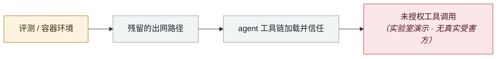

# TrustFall：一次回车即 RCE

TrustFall: RCE on a single keypress

      

## 概要

Adversa AI：影响 **Claude Code、Gemini CLI、Cursor CLI、GitHub Copilot** 四款 agentic CLI 的系统性架构缺陷。恶意仓库配置在开发者接受「文件夹信任」提示后**自动启动项目级 MCP server** —— 开发者环境里一次回车就以本人权限跑起攻击者的代码，**headless CI 工作流里连提示都没有**。关键点：`enableAllProjectMcpServers` **没有像 `bypassPermissions` 那样被禁止在项目作用域设置**；且 **Claude Code v2.1+ 的对话框去掉了早先的 MCP 警告**

## 攻击链

## 来源

| # | 来源 | 链接 |
|---|---|---|
| 1 | Adversa | <https://adversa.ai/blog/trustfall-coding-agent-security-flaw-rce-claude-cursor-gemini-cli-copilot/> |
| 2 | Dark Reading | <https://www.darkreading.com/application-security/trustfall-exposes-claude-code-execution-risk> |

## 元数据

| 字段 | 值 |
|---|---|
| 日期 | `2026-05-07`（原文：2026-05-07，精度 `day`） |
| 性质 | 研究演示 `research` |
| 类型 | [`SANDBOX`](../../../../taxonomy/types.md#sandbox) 沙箱逃逸 · [`MCP`](../../../../taxonomy/types.md#mcp) MCP / 工具链 |
| 严重度 | **中** `medium` |
| 可信度 | **A** — 一手来源（厂商 / 受害方 / 执法 / 官方报告） |
| 真实伤害 | 否 |
| AI 参与 | 已确认 `confirmed` |
| 地区 | [全球](../../../../regions/global.md) |
| 档案编号 | `2026-05-07-trustfall-rce-yi-ci-hui` |

**判定依据**：研究机构或厂商的受控演示，`real_harm: false`；收录是为了标记攻击面何时被公开。 判 `medium`：受控演示、中等缺陷，或单用户 / 单机范围的事故。 分级口径见 [taxonomy/severity.md](../../../../taxonomy/severity.md) 与 [taxonomy/confidence.md](../../../../taxonomy/confidence.md)。

## 相关

**所属专题**：[前沿模型自主越界](../../../../topics/eval-escapes.md) · [agent 供应链投毒](../../../../topics/agent-supply-chain.md)

**同类条目**：

- `2026-05-08` [Cline Kanban 跨源 WebSocket 劫持（CVE-2026-44211）](../../../2026-05/2026-05-08-cline-kanban-websocket.md)   Cline Kanban cross-origin WebSocket hijack (CVE-2026-44211)
- `2026-04-16` [MCPwn（CVE-2026-33032）：nginx-ui 的 MCP 端点在野被打](../../../2026-04/2026-04-16-mcpwn-nginx-ui-in-the-wild.md)   MCPwn (CVE-2026-33032): nginx-ui MCP endpoint hit in the wild
- `2026-04-15` [Windsurf 零点击 MCP RCE（CVE-2026-30615）](../../../2026-04/2026-04-15-windsurf-mcp-rce.md)   Windsurf zero-click MCP RCE (CVE-2026-30615)
- `2026-04-24` [Gemini CLI CVSS 10.0：一个 PR 就能打穿 CI](../../../2026-04/2026-04-24-gemini-cli-pr-ci.md)   Gemini CLI CVSS 10.0: one pull request compromises CI

---

[← English original](../../../2026-05/2026-05-07-trustfall-rce-yi-ci-hui.md) · [2026-05 index](../../../2026-05/README.md) · [All records](../../../README.md) · [Home](../../../../README.md)

本条目属于 **Orca AI Incident Archive**，按 [CC BY 4.0](../../../../LICENSE) 授权。发现事实错误或缺少来源，请[提 issue 或 PR](../../../../CONTRIBUTING.md)——更正会写进条目的修订记录，不会静默覆盖。
