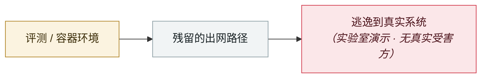

# Cline Kanban 跨源 WebSocket 劫持（CVE-2026-44211）

Cline Kanban cross-origin WebSocket hijack (CVE-2026-44211)

     

## 概要

**CVSS 9.7**，影响 ≤ 2.13.0。cline CLI 用的 `kanban` npm 包在 `127.0.0.1:3484` 起了一个 **不校验 Origin 头**的 WebSocket 服务 —— **开发者访问的任何网站都能静默连上去**，实时窃取数据，并**向 agent 的输入注入任意提示、劫持正在运行的 AI agent 终端**，达成 RCE。**披露时无公开补丁**

## 攻击链

## 来源

| # | 来源 | 链接 |
|---|---|---|
| 1 | GHSA / GitLab Advisory | <https://advisories.gitlab.com/npm/cline/CVE-2026-44211/> |
| 2 | CybersecurityNews | <https://cybersecuritynews.com/cline-ai-agent-vulnerability/> |

## 元数据

| 字段 | 值 |
|---|---|
| 日期 | `2026-05-08`（原文：2026-05-08，精度 `day`） |
| 性质 | 研究演示 `research` |
| 类型 | [`SANDBOX`](../../../../taxonomy/types.md#sandbox) 沙箱逃逸 |
| 严重度 | **高** `high` |
| 可信度 | **A** — 一手来源（厂商 / 受害方 / 执法 / 官方报告） |
| 真实伤害 | 否 |
| AI 参与 | 已确认 `confirmed` |
| 地区 | [全球](../../../../regions/global.md) |
| 档案编号 | `2026-05-08-cline-kanban-websocket` |

**判定依据**：研究机构或厂商的受控演示，`real_harm: false`；收录是为了标记攻击面何时被公开。 判 `high`：真实损害范围有限，或属 CVSS 9+ 的严重缺陷，或是有重要意义的能力实证。 分级口径见 [taxonomy/severity.md](../../../../taxonomy/severity.md) 与 [taxonomy/confidence.md](../../../../taxonomy/confidence.md)。

## 相关

**所属专题**：[前沿模型自主越界](../../../../topics/eval-escapes.md)

**同类条目**：

- `2026-05-07` [TrustFall：一次回车即 RCE](../../../2026-05/2026-05-07-trustfall-rce-yi-ci-hui.md)   TrustFall: RCE on a single keypress
- `2026-04-15` [Windsurf 零点击 MCP RCE（CVE-2026-30615）](../../../2026-04/2026-04-15-windsurf-mcp-rce.md)   Windsurf zero-click MCP RCE (CVE-2026-30615)
- `2026-04-24` [Gemini CLI CVSS 10.0：一个 PR 就能打穿 CI](../../../2026-04/2026-04-24-gemini-cli-pr-ci.md)   Gemini CLI CVSS 10.0: one pull request compromises CI
- `2026-06-30` [GuardFall：11 个开源 agent 中 10 个可绕过 shell 边界](../../../2026-06/2026-06-30-guardfall-agent-shell.md)   GuardFall: 10 of 11 open-source agents can be pushed past their shell boundary

---

[← English original](../../../2026-05/2026-05-08-cline-kanban-websocket.md) · [2026-05 index](../../../2026-05/README.md) · [All records](../../../README.md) · [Home](../../../../README.md)

本条目属于 **Orca AI Incident Archive**，按 [CC BY 4.0](../../../../LICENSE) 授权。发现事实错误或缺少来源，请[提 issue 或 PR](../../../../CONTRIBUTING.md)——更正会写进条目的修订记录，不会静默覆盖。
