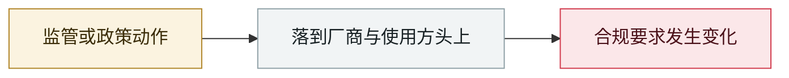

# Google 发布 Gemini Spark 自主 agent

Google ships Gemini Spark autonomous agents

     

## 概要

基于 Gemini 3.5 Flash + Antigravity 控制平面，可跨 Workspace 执行多步任务

## 攻击链

## 来源

| # | 来源 | 链接 |
|---|---|---|
| 1 | Google | <https://blog.google/innovation-and-ai/products/gemini-app/next-evolution-gemini-app/> |

## 元数据

| 字段 | 值 |
|---|---|
| 日期 | `2026-05-19`（原文：2026-05-19，精度 `day`） |
| 性质 | 政策 / 监管 `policy` |
| 类型 | [`OTHER`](../../../../taxonomy/types.md#other) 其他 |
| 严重度 | **信息** `info` |
| 可信度 | **A** — 一手来源（厂商 / 受害方 / 执法 / 官方报告） |
| 真实伤害 | 不适用 |
| AI 参与 | 已确认 `confirmed` |
| 地区 | [全球](../../../../regions/global.md) |
| 档案编号 | `2026-05-19-google-gemini-spark-agent` |

**判定依据**：政策 / 监管动作，不计入事故统计，`severity` 记为 `info`。 分级口径见 [taxonomy/severity.md](../../../../taxonomy/severity.md) 与 [taxonomy/confidence.md](../../../../taxonomy/confidence.md)。

---

[← English original](../../../2026-05/2026-05-19-google-gemini-spark-agent.md) · [2026-05 index](../../../2026-05/README.md) · [All records](../../../README.md) · [Home](../../../../README.md)

本条目属于 **Orca AI Incident Archive**，按 [CC BY 4.0](../../../../LICENSE) 授权。发现事实错误或缺少来源，请[提 issue 或 PR](../../../../CONTRIBUTING.md)——更正会写进条目的修订记录，不会静默覆盖。
