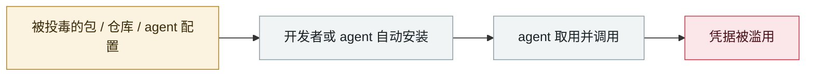

# TrapDoor：跨三个生态投毒，专门污染 AI 助手配置

TrapDoor: poisoning three ecosystems to corrupt AI assistant configs

      

## 概要

**34 个恶意包、384+ 个构件版本**，横跨 **npm(21) + PyPI(7) + Crates.io(6)**，最早构件 2026-05-22 上传、基础设施显示实际起点 05-19。除常规窃取（SSH 密钥、AWS 凭据、GitHub token、Sui/Solana/Aptos 钱包、浏览器登录数据、环境变量、API key）外，**新技法是把用零宽 Unicode 隐藏的指令塞进 `.cursorrules` 与 `CLAUDE.md`** —— 当 Claude Code 或 Cursor 读到这些文件时，就会执行一次**假的「安全扫描」**，静默把凭据带走

## 攻击链

## 来源

| # | 来源 | 链接 |
|---|---|---|
| 1 | THN | <https://thehackernews.com/2026/05/trapdoor-supply-chain-attack-spreads.html> |
| 2 | SlowMist 分析 | <https://slowmist.medium.com/threat-intelligence-trapdoor-analysis-a-cross-ecosystem-supply-chain-credential-theft-operation-a9a4e11616ea> |
| 3 | Phoenix Security | <https://phoenix.security/trapdoor-supply-chain-ai-poisoning-npm-pypi-crates/> |

## 元数据

| 字段 | 值 |
|---|---|
| 日期 | `2026-05-19`（原文：2026-05-19，精度 `day`） |
| 性质 | 真实事故 `incident` |
| 类型 | [`SUPPLY`](../../../../taxonomy/types.md#supply) 供应链投毒 · [`CRED`](../../../../taxonomy/types.md#cred) 凭据滥用 |
| 严重度 | **严重** `critical` |
| 可信度 | **A** — 一手来源（厂商 / 受害方 / 执法 / 官方报告） |
| 真实伤害 | 是 |
| AI 参与 | 已确认 `confirmed` |
| 地区 | [全球](../../../../regions/global.md) |
| 档案编号 | `2026-05-19-trapdoor-poisons-agent-configs` |

**判定依据**：真实事故，有确认的受害方。 判 `critical`：确认的真实损害达到多组织 / 政府 / 关键基础设施 / 供应链蠕虫级别，或属首次出现且有真实受害方的能力里程碑。 分级口径见 [taxonomy/severity.md](../../../../taxonomy/severity.md) 与 [taxonomy/confidence.md](../../../../taxonomy/confidence.md)。

## 相关

**所属专题**：[agent 供应链投毒](../../../../topics/agent-supply-chain.md)

**同类条目**：

- `2026-05-21` [Composio：agent 自动化本身成了提权路径](../../../2026-05/2026-05-21-composio-agent-automation-privesc.md)   Composio: agent automation itself becomes the privilege-escalation path
- `2026-05-11` [TanStack npm "Mini Shai-Hulud"](../../../2026-05/2026-05-11-tanstack-npm-mini-shai.md)   TanStack npm "Mini Shai-Hulud"
- `2026-05-18` [GitHub 内部 3,800 个仓库被攻陷](../../../2026-05/2026-05-18-github-3800-internal-repos.md)   3,800 internal GitHub repositories compromised
- `2026-05-04` [Braintrust 的 AWS 账号被攻陷，要求全体客户轮换 AI 密钥](../../../2026-05/2026-05-04-braintrust-aws-zhang-hao-gong.md)   Braintrust's AWS account compromised, all customers told to rotate AI keys

---

[← English original](../../../2026-05/2026-05-19-trapdoor-poisons-agent-configs.md) · [2026-05 index](../../../2026-05/README.md) · [All records](../../../README.md) · [Home](../../../../README.md)

本条目属于 **Orca AI Incident Archive**，按 [CC BY 4.0](../../../../LICENSE) 授权。发现事实错误或缺少来源，请[提 issue 或 PR](../../../../CONTRIBUTING.md)——更正会写进条目的修订记录，不会静默覆盖。
