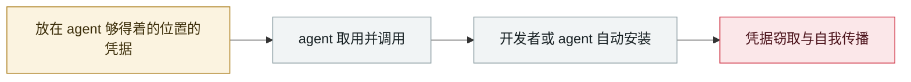

# Composio：agent 自动化本身成了提权路径

Composio: agent automation itself becomes the privilege-escalation path

      

## 概要

agentic 集成平台 Composio 自曝：攻击者外带 **约 5,241 个 API key 与 5,001 个 GitHub OAuth token**。

攻击链值得单独记：攻击者**先在一个「监控 Composio 自身基础设施的内部 agentic 工具」上取得立足点**，再**经由那套「自动修复连接器错误的自动化补救系统」提权**，然后在平台沙箱中注册恶意工具定义，最终在工具执行沙箱内取得任意代码执行 —— **用来自动化运维的 agent，成了攻击者的提权阶梯**

## 攻击链

## 来源

| # | 来源 | 链接 |
|---|---|---|
| 1 | Composio 官方事故报告 | <https://composio.dev/blog/composio-may-2026-security-incident> |
| 2 | Material Security 分析 | <https://material.security/resources/the-composio-breach-one-token-10242-doors> |

## 元数据

| 字段 | 值 |
|---|---|
| 日期 | `2026-05-21`（原文：2026-05-21，精度 `day`） |
| 性质 | 真实事故 `incident` |
| 类型 | [`CRED`](../../../../taxonomy/types.md#cred) 凭据滥用 · [`SUPPLY`](../../../../taxonomy/types.md#supply) 供应链投毒 |
| 严重度 | **严重** `critical` |
| 可信度 | **A** — 一手来源（厂商 / 受害方 / 执法 / 官方报告） |
| 真实伤害 | 是 |
| AI 参与 | 已确认 `confirmed` |
| 地区 | [全球](../../../../regions/global.md) |
| 档案编号 | `2026-05-21-composio-agent-automation-privesc` |

**判定依据**：真实事故，有确认的受害方。 判 `critical`：确认的真实损害达到多组织 / 政府 / 关键基础设施 / 供应链蠕虫级别，或属首次出现且有真实受害方的能力里程碑。 分级口径见 [taxonomy/severity.md](../../../../taxonomy/severity.md) 与 [taxonomy/confidence.md](../../../../taxonomy/confidence.md)。

## 相关

**所属专题**：[agent 供应链投毒](../../../../topics/agent-supply-chain.md)

**同类条目**：

- `2026-05-19` [TrapDoor：跨三个生态投毒，专门污染 AI 助手配置](../../../2026-05/2026-05-19-trapdoor-poisons-agent-configs.md)   TrapDoor: poisoning three ecosystems to corrupt AI assistant configs
- `2026-05-11` [TanStack npm "Mini Shai-Hulud"](../../../2026-05/2026-05-11-tanstack-npm-mini-shai.md)   TanStack npm "Mini Shai-Hulud"
- `2026-05-18` [GitHub 内部 3,800 个仓库被攻陷](../../../2026-05/2026-05-18-github-3800-internal-repos.md)   3,800 internal GitHub repositories compromised
- `2026-05-04` [Braintrust 的 AWS 账号被攻陷，要求全体客户轮换 AI 密钥](../../../2026-05/2026-05-04-braintrust-aws-zhang-hao-gong.md)   Braintrust's AWS account compromised, all customers told to rotate AI keys

---

[← English original](../../../2026-05/2026-05-21-composio-agent-automation-privesc.md) · [2026-05 index](../../../2026-05/README.md) · [All records](../../../README.md) · [Home](../../../../README.md)

本条目属于 **Orca AI Incident Archive**，按 [CC BY 4.0](../../../../LICENSE) 授权。发现事实错误或缺少来源，请[提 issue 或 PR](../../../../CONTRIBUTING.md)——更正会写进条目的修订记录，不会静默覆盖。
