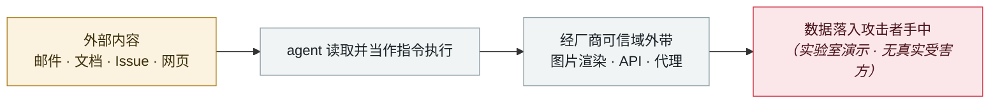

# Microsoft Copilot Cowork 文件外泄

Microsoft Copilot Cowork file exfiltration

      

## 概要

PromptArmor：污染用户可控路径下**自动加载的 "skill"**，诱导 agent 生成含预认证下载链接的消息。**该消息是自动批准发给用户本人的，因此绕过安全控制**；用户一打开，agent 就向攻击者服务器发请求。**与模型无关**（Claude Opus 4.7 亦然），配合定时任务功能威胁放大

## 攻击链

## 来源

| # | 来源 | 链接 |
|---|---|---|
| 1 | PromptArmor | <https://www.promptarmor.com/resources/microsoft-copilot-cowork-exfiltrates-files> |

## 元数据

| 字段 | 值 |
|---|---|
| 日期 | `2026-05-26`（原文：2026-05-26，精度 `day`） |
| 性质 | 研究演示 `research` |
| 类型 | [`IPI`](../../../../taxonomy/types.md#ipi) 间接提示注入 · [`EXFIL`](../../../../taxonomy/types.md#exfil) 数据外泄 |
| 严重度 | **高** `high` |
| 可信度 | **A** — 一手来源（厂商 / 受害方 / 执法 / 官方报告） |
| 真实伤害 | 否 |
| AI 参与 | 已确认 `confirmed` |
| 地区 | [全球](../../../../regions/global.md) |
| 档案编号 | `2026-05-26-microsoft-copilot-cowork` |

**判定依据**：研究机构或厂商的受控演示，`real_harm: false`；收录是为了标记攻击面何时被公开。 判 `high`：真实损害范围有限，或属 CVSS 9+ 的严重缺陷，或是有重要意义的能力实证。 分级口径见 [taxonomy/severity.md](../../../../taxonomy/severity.md) 与 [taxonomy/confidence.md](../../../../taxonomy/confidence.md)。

## 相关

**所属专题**：[零点击数据外泄链](../../../../topics/zero-click-exfil.md)

**同类条目**：

- `2026-05-04` [Grok / Bankrbot 摩尔斯电码提示注入](../../../2026-05/2026-05-04-grok-bankrbot-mo-er-si.md)   Grok / Bankrbot Morse-code prompt injection
- `2026-05-12` [巴西劳动法院首次因提示注入处罚律师](../../../2026-05/2026-05-12-brazil-labor-court-prompt-injection-sanction.md)   Brazilian labour court sanctions lawyers over prompt injection
- `2026-05-12` [ClaudeBleed：零权限扩展劫持 Claude for Chrome](../../../2026-05/2026-05-12-claudebleed-claude-chrome.md)   ClaudeBleed: a zero-permission extension hijacks Claude for Chrome
- `2026-05-22` [Google AI 搜索「disregard」bug](../../../2026-05/2026-05-22-google-disregard-bug.md)   Google AI Search "disregard" bug

---

[← English original](../../../2026-05/2026-05-26-microsoft-copilot-cowork.md) · [2026-05 index](../../../2026-05/README.md) · [All records](../../../README.md) · [Home](../../../../README.md)

本条目属于 **Orca AI Incident Archive**，按 [CC BY 4.0](../../../../LICENSE) 授权。发现事实错误或缺少来源，请[提 issue 或 PR](../../../../CONTRIBUTING.md)——更正会写进条目的修订记录，不会静默覆盖。
