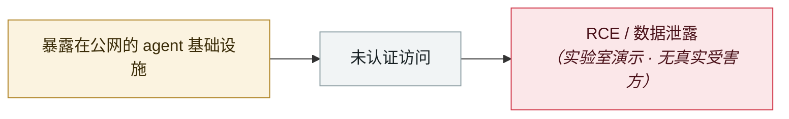

# BadHost（CVE-2026-48710）

BadHost (CVE-2026-48710)

     

## 概要

Starlette < 1.0.1 未净化 HTTP Host 头即拼接生成 `request.url`，攻击者可篡改 `request.url.path` **绕过路径型认证中间件**。**影响 FastAPI 及 vLLM、LiteLLM、MCP server 等整个 Python AI 生态**。Ars Technica 标题：「数百万 AI agent 因一个开源包的严重漏洞陷入危险」

## 攻击链

## 来源

| # | 来源 | 链接 |
|---|---|---|
| 1 | badhost.org | <https://badhost.org/> |
| 2 | Ars Technica | <https://arstechnica.com/information-technology/2026/05/millions-of-ai-agents-imperiled-by-critical-vulnerability-in-open-source-package/> |

## 元数据

| 字段 | 值 |
|---|---|
| 日期 | `2026-05-28`（原文：2026-05-28，精度 `day`） |
| 性质 | 研究演示 `research` |
| 类型 | [`INFRA`](../../../../taxonomy/types.md#infra) agent 基础设施暴露 |
| 严重度 | **高** `high` |
| 可信度 | **A** — 一手来源（厂商 / 受害方 / 执法 / 官方报告） |
| 真实伤害 | 否 |
| AI 参与 | 已确认 `confirmed` |
| 地区 | [全球](../../../../regions/global.md) |
| 档案编号 | `2026-05-28-badhost` |

**判定依据**：研究机构或厂商的受控演示，`real_harm: false`；收录是为了标记攻击面何时被公开。 判 `high`：真实损害范围有限，或属 CVSS 9+ 的严重缺陷，或是有重要意义的能力实证。 分级口径见 [taxonomy/severity.md](../../../../taxonomy/severity.md) 与 [taxonomy/confidence.md](../../../../taxonomy/confidence.md)。

## 相关

**所属专题**：[agent 基础设施暴露](../../../../topics/agent-infra.md)

**同类条目**：

- `2026-05-07` [Semantic Kernel：提示注入变成 shell](../../../2026-05/2026-05-07-semantic-kernel-shell.md)   Semantic Kernel: prompt injection turns into a shell
- `2026-04-16` [MCPwn（CVE-2026-33032）：nginx-ui 的 MCP 端点在野被打](../../../2026-04/2026-04-16-mcpwn-nginx-ui-in-the-wild.md)   MCPwn (CVE-2026-33032): nginx-ui MCP endpoint hit in the wild
- `2026-04-07` [Flowise CVE-2025-59528 在野利用](../../../2026-04/2026-04-07-flowise-ye-li-yong.md)   Flowise CVE-2025-59528 exploited in the wild
- `2026-04-23` [OpenClaw「Claw Chain」四漏洞链，24.5 万台服务器暴露](../../../2026-04/2026-04-23-openclaw-claw-chain.md)   OpenClaw "Claw Chain": four chained flaws, 245,000 servers exposed

---

[← English original](../../../2026-05/2026-05-28-badhost.md) · [2026-05 index](../../../2026-05/README.md) · [All records](../../../README.md) · [Home](../../../../README.md)

本条目属于 **Orca AI Incident Archive**，按 [CC BY 4.0](../../../../LICENSE) 授权。发现事实错误或缺少来源，请[提 issue 或 PR](../../../../CONTRIBUTING.md)——更正会写进条目的修订记录，不会静默覆盖。
