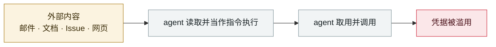

# 黑客直接「请求」Meta AI 客服机器人交出 Instagram 账号

Attackers simply ask Meta's AI support bot for Instagram accounts

      

## 概要

用提示注入诱导 AI 把攻击者邮箱绑定到目标账户，**绕过两因素认证**。典型「混淆代理人(confused deputy)」问题 —— AI 对攻击者身份校验设计不足。**约 34,000 个账户**（04-17 → 05-31，共 44 天）被有组织接管转卖；仅需用户名即可发起。Meta 于 **05-29** 紧急修补并限制账号恢复 API

## 攻击链

## 来源

| # | 来源 | 链接 |
|---|---|---|
| 1 | Krebs | <https://krebsonsecurity.com/2026/06/hackers-used-metas-ai-support-bot-to-seize-instagram-accounts/> |
| 2 | 404 Media | <https://www.404media.co/hackers-simply-asked-meta-ai-to-give-them-access-to-high-profile-instagram-accounts-it-worked/> |
| 3 | Ars Technica | <https://arstechnica.com/ai/2026/06/meta-ai-support-chatbot-gave-hackers-access-to-notable-instagram-accounts/> |

## 元数据

| 字段 | 值 |
|---|---|
| 日期 | `2026-06-01`（原文：2026-06-01，精度 `day`） |
| 性质 | 真实事故 `incident` |
| 类型 | [`IPI`](../../../../taxonomy/types.md#ipi) 间接提示注入 · [`CRED`](../../../../taxonomy/types.md#cred) 凭据滥用 |
| 严重度 | **严重** `critical` |
| 可信度 | **A** — 一手来源（厂商 / 受害方 / 执法 / 官方报告） |
| 真实伤害 | 是 |
| AI 参与 | 已确认 `confirmed` |
| 地区 | [全球](../../../../regions/global.md) |
| 档案编号 | `2026-06-01-meta-ai-support-bot-hands-over-instagram` |

**判定依据**：真实事故，有确认的受害方。 判 `critical`：确认的真实损害达到多组织 / 政府 / 关键基础设施 / 供应链蠕虫级别，或属首次出现且有真实受害方的能力里程碑。 分级口径见 [taxonomy/severity.md](../../../../taxonomy/severity.md) 与 [taxonomy/confidence.md](../../../../taxonomy/confidence.md)。

## 相关

**所属专题**：[零点击数据外泄链](../../../../topics/zero-click-exfil.md)

**同类条目**：

- `2026-06-01` [Miasma 蠕虫](../../../2026-06/2026-06-01-miasma-worm.md)   Miasma worm
- `2026-06-17` [Sapphire Sleet 88 分钟投毒 Mastra AI 全 scope](../../../2026-06/2026-06-17-sapphire-sleet-mastra-88-minutes.md)   Sapphire Sleet poisons every Mastra AI scope in 88 minutes
- `2026-06-04` [Claude Oceanus-v1-p 被非法分发](../../../2026-06/2026-06-04-claude-oceanus-fei-fa-fen.md)   Claude Oceanus-v1-p illegally redistributed
- `2026-06-13` [PromptSnatcher：广告拦截扩展偷 AI 对话](../../../2026-06/2026-06-13-promptsnatcher-guang-gao-lan-jie.md)   PromptSnatcher: ad-blocking extensions steal AI conversations

---

[← English original](../../../2026-06/2026-06-01-meta-ai-support-bot-hands-over-instagram.md) · [2026-06 index](../../../2026-06/README.md) · [All records](../../../README.md) · [Home](../../../../README.md)

本条目属于 **Orca AI Incident Archive**，按 [CC BY 4.0](../../../../LICENSE) 授权。发现事实错误或缺少来源，请[提 issue 或 PR](../../../../CONTRIBUTING.md)——更正会写进条目的修订记录，不会静默覆盖。
