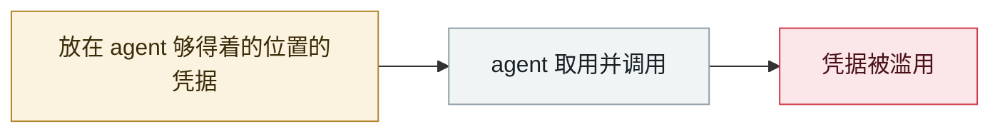

# Claude Oceanus-v1-p 被非法分发

Claude Oceanus-v1-p illegally redistributed

     

## 概要

仅对少数红队开放的下一代模型，评测刚开始就被滥用分发渠道，**经中国的代理服务非法转售 API 访问**。Anthropic 暂停红队访问并内部调查

## 攻击链

## 来源

| # | 来源 | 链接 |
|---|---|---|
| 1 | CybersecurityNews | <https://cybersecuritynews.com/anthropics-claude-oceanus-v1-p/> |

## 元数据

| 字段 | 值 |
|---|---|
| 日期 | `2026-06-04`（原文：2026-06-04，精度 `day`） |
| 性质 | 漏洞披露 `vulnerability` |
| 类型 | [`CRED`](../../../../taxonomy/types.md#cred) 凭据滥用 |
| 严重度 | **高** `high` |
| 可信度 | **B** — 研究机构或主流媒体，有可核查细节 |
| 真实伤害 | 是 |
| AI 参与 | 已确认 `confirmed` |
| 地区 | [全球](../../../../regions/global.md) · [中国](../../../../regions/cn.md) |
| 档案编号 | `2026-06-04-claude-oceanus-fei-fa-fen` |

**判定依据**：漏洞披露，已确认在野利用，故 `real_harm: true`。 判 `high`：真实损害范围有限，或属 CVSS 9+ 的严重缺陷，或是有重要意义的能力实证。 分级口径见 [taxonomy/severity.md](../../../../taxonomy/severity.md) 与 [taxonomy/confidence.md](../../../../taxonomy/confidence.md)。

## 相关

**同类条目**：

- `2026-06-01` [Miasma 蠕虫](../../../2026-06/2026-06-01-miasma-worm.md)   Miasma worm
- `2026-06-01` [黑客直接「请求」Meta AI 客服机器人交出 Instagram 账号](../../../2026-06/2026-06-01-meta-ai-support-bot-hands-over-instagram.md)   Attackers simply ask Meta's AI support bot for Instagram accounts
- `2026-06-17` [Sapphire Sleet 88 分钟投毒 Mastra AI 全 scope](../../../2026-06/2026-06-17-sapphire-sleet-mastra-88-minutes.md)   Sapphire Sleet poisons every Mastra AI scope in 88 minutes
- `2026-06-13` [PromptSnatcher：广告拦截扩展偷 AI 对话](../../../2026-06/2026-06-13-promptsnatcher-guang-gao-lan-jie.md)   PromptSnatcher: ad-blocking extensions steal AI conversations

---

[← English original](../../../2026-06/2026-06-04-claude-oceanus-fei-fa-fen.md) · [2026-06 index](../../../2026-06/README.md) · [All records](../../../README.md) · [Home](../../../../README.md)

本条目属于 **Orca AI Incident Archive**，按 [CC BY 4.0](../../../../LICENSE) 授权。发现事实错误或缺少来源，请[提 issue 或 PR](../../../../CONTRIBUTING.md)——更正会写进条目的修订记录，不会静默覆盖。
