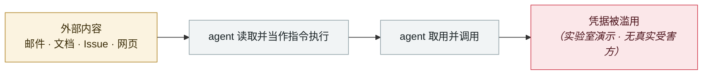

# AgentForger：一条链接伪造出一个「AI 内鬼」

AgentForger: one link forges an "AI insider"

      

## 概要

Zenity Labs（研究者 Mike Takahashi），OpenAI 于 06-08 修复、07 月公开。这是一次 **CSRF —— 但伪造出来的是一个攻击者控制的自主 AI agent**。员工点开一条看起来无害的 ChatGPT 链接，就会在公司信任边界内**凭该员工的真实权限、且审批被关掉**地生成一个新 agent。这个「agentic 内鬼」可以测绘组织结构、外带敏感文档、收割凭据，并**在 Slack、Teams 与邮件中冒充受害者**；报道称它**每五分钟就向攻击者领一次指令**

## 攻击链

## 来源

| # | 来源 | 链接 |
|---|---|---|
| 1 | Zenity Labs | <https://labs.zenity.io/p/agentforger-part-1-chatgpt-cross-site-agent-forgery> |
| 2 | THN | <https://thehackernews.com/2026/07/chatgpt-agentforger-flaw-could-deploy.html> |

## 元数据

| 字段 | 值 |
|---|---|
| 日期 | `2026-06-08`（原文：2026-06-08，精度 `day`） |
| 性质 | 研究演示 `research` |
| 类型 | [`IPI`](../../../../taxonomy/types.md#ipi) 间接提示注入 · [`CRED`](../../../../taxonomy/types.md#cred) 凭据滥用 |
| 严重度 | **中** `medium` |
| 可信度 | **A** — 一手来源（厂商 / 受害方 / 执法 / 官方报告） |
| 真实伤害 | 否 |
| AI 参与 | 已确认 `confirmed` |
| 地区 | [全球](../../../../regions/global.md) |
| 档案编号 | `2026-06-08-agentforger-yi-tiao-lian-jie` |

**判定依据**：研究机构或厂商的受控演示，`real_harm: false`；收录是为了标记攻击面何时被公开。 判 `medium`：受控演示、中等缺陷，或单用户 / 单机范围的事故。 分级口径见 [taxonomy/severity.md](../../../../taxonomy/severity.md) 与 [taxonomy/confidence.md](../../../../taxonomy/confidence.md)。

## 相关

**所属专题**：[零点击数据外泄链](../../../../topics/zero-click-exfil.md)

**同类条目**：

- `2026-06-01` [Miasma 蠕虫](../../../2026-06/2026-06-01-miasma-worm.md)   Miasma worm
- `2026-06-01` [黑客直接「请求」Meta AI 客服机器人交出 Instagram 账号](../../../2026-06/2026-06-01-meta-ai-support-bot-hands-over-instagram.md)   Attackers simply ask Meta's AI support bot for Instagram accounts
- `2026-06-17` [Sapphire Sleet 88 分钟投毒 Mastra AI 全 scope](../../../2026-06/2026-06-17-sapphire-sleet-mastra-88-minutes.md)   Sapphire Sleet poisons every Mastra AI scope in 88 minutes
- `2026-06-04` [Claude Oceanus-v1-p 被非法分发](../../../2026-06/2026-06-04-claude-oceanus-fei-fa-fen.md)   Claude Oceanus-v1-p illegally redistributed

---

[← English original](../../../2026-06/2026-06-08-agentforger-yi-tiao-lian-jie.md) · [2026-06 index](../../../2026-06/README.md) · [All records](../../../README.md) · [Home](../../../../README.md)

本条目属于 **Orca AI Incident Archive**，按 [CC BY 4.0](../../../../LICENSE) 授权。发现事实错误或缺少来源，请[提 issue 或 PR](../../../../CONTRIBUTING.md)——更正会写进条目的修订记录，不会静默覆盖。
