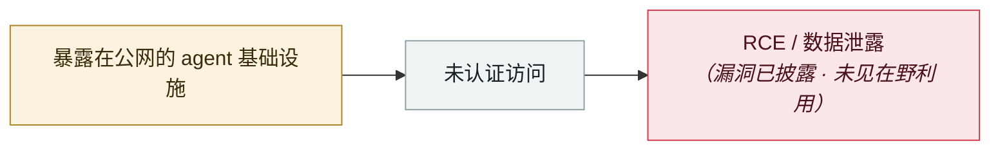

# LiteLLM CVE-2026-42271 MCP 端点接管

LiteLLM CVE-2026-42271 MCP endpoint takeover

     

## 概要

与 CVE-2026-42208(Pre-Auth SQLi)、CVE-2026-48710(BadHost) 组成 RCE 链；**首次利用出现在 36 小时内**，06-08 进 CISA KEV。LiteLLM 持有主密钥与云凭据

## 攻击链

## 来源

| # | 来源 | 链接 |
|---|---|---|
| 1 | Theori | <https://theori.io/ko/blog/2026-h1-hot-security-issue-case> |

## 元数据

| 字段 | 值 |
|---|---|
| 日期 | `2026-06-08`（原文：2026-06-08，精度 `day`） |
| 性质 | 漏洞披露 `vulnerability` |
| 类型 | [`INFRA`](../../../../taxonomy/types.md#infra) agent 基础设施暴露 |
| 严重度 | **高** `high` |
| 可信度 | **A** — 一手来源（厂商 / 受害方 / 执法 / 官方报告） |
| 真实伤害 | 否 |
| AI 参与 | 已确认 `confirmed` |
| 地区 | [全球](../../../../regions/global.md) |
| 档案编号 | `2026-06-08-litellm-mcp-duan-dian-jie` |

**判定依据**：漏洞披露，截至归档未见在野利用证据，故 `real_harm: false`。 判 `high`：真实损害范围有限，或属 CVSS 9+ 的严重缺陷，或是有重要意义的能力实证。 分级口径见 [taxonomy/severity.md](../../../../taxonomy/severity.md) 与 [taxonomy/confidence.md](../../../../taxonomy/confidence.md)。

## 相关

**所属专题**：[agent 基础设施暴露](../../../../topics/agent-infra.md)

**同类条目**：

- `2026-06-29` [DifyTap：4 个漏洞让 100 万+ AI 应用被跨租户窃听](../../../2026-06/2026-06-29-difytap-lou-dong-rang-wan.md)   DifyTap: four flaws leave 1M+ AI apps open to cross-tenant eavesdropping
- `2026-06-28` [Langflow CVE-2026-33017 被用于门罗币挖矿](../../../2026-06/2026-06-28-langflow-yong-yu-men-luo.md)   Langflow CVE-2026-33017 used for Monero mining
- `2026-06-17` [Vertex AI SDK 存储桶抢占 → 跨租户 RCE](../../../2026-06/2026-06-17-vertex-sdk-rce.md)   Vertex AI SDK bucket takeover leads to cross-tenant RCE
- `2026-06-18` [AutoJack：AutoGen Studio 一个网页打穿宿主](../../../2026-06/2026-06-18-autojack-autogen-studio.md)   AutoJack: one web page from AutoGen Studio to the host

---

[← English original](../../../2026-06/2026-06-08-litellm-mcp-duan-dian-jie.md) · [2026-06 index](../../../2026-06/README.md) · [All records](../../../README.md) · [Home](../../../../README.md)

本条目属于 **Orca AI Incident Archive**，按 [CC BY 4.0](../../../../LICENSE) 授权。发现事实错误或缺少来源，请[提 issue 或 PR](../../../../CONTRIBUTING.md)——更正会写进条目的修订记录，不会静默覆盖。
