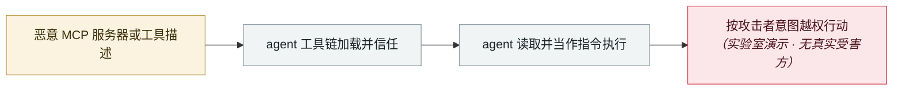

# Agentjacking：一个公开 DSN 就能劫持 AI 编码 agent

Agentjacking: one public DSN hijacks AI coding agents

      

## 概要

Tenet Security：攻击者只需一个 **Sentry DSN**（一种**可从浏览器 JavaScript 或 GitHub 搜索里捡到的公开只写凭据**）加任意 HTTP 客户端，就能把恶意指令注入 Sentry 的错误事件。**Claude Code、Cursor、Codex 经 MCP 取回这些事件后，无法把它们与真实的应用错误区分开**，并以开发者本人的系统权限执行攻击者的命令。Tenet 识别出**至少 2,388 个组织的 DSN 公开暴露**。可窃取环境变量、`~/.aws/config`、npm token、Docker 凭据、git 凭据与私有仓库 URL

## 攻击链

## 来源

| # | 来源 | 链接 |
|---|---|---|
| 1 | Tenet Security | <https://tenetsecurity.ai/blog/agentjacking-coding-agents-with-fake-sentry-errors/> |
| 2 | The New Stack | <https://thenewstack.io/agentjacking-sentry-mcp-attack/> |

## 元数据

| 字段 | 值 |
|---|---|
| 日期 | `2026-06-12`（原文：2026-06-12，精度 `day`） |
| 性质 | 研究演示 `research` |
| 类型 | [`MCP`](../../../../taxonomy/types.md#mcp) MCP / 工具链 · [`IPI`](../../../../taxonomy/types.md#ipi) 间接提示注入 |
| 严重度 | **高** `high` |
| 可信度 | **A** — 一手来源（厂商 / 受害方 / 执法 / 官方报告） |
| 真实伤害 | 否 |
| AI 参与 | 已确认 `confirmed` |
| 地区 | [全球](../../../../regions/global.md) |
| 档案编号 | `2026-06-12-agentjacking-public-dsn` |

**判定依据**：研究机构或厂商的受控演示，`real_harm: false`；收录是为了标记攻击面何时被公开。 判 `high`：真实损害范围有限，或属 CVSS 9+ 的严重缺陷，或是有重要意义的能力实证。 分级口径见 [taxonomy/severity.md](../../../../taxonomy/severity.md) 与 [taxonomy/confidence.md](../../../../taxonomy/confidence.md)。

## 相关

**所属专题**：[agent 供应链投毒](../../../../topics/agent-supply-chain.md) · [零点击数据外泄链](../../../../topics/zero-click-exfil.md)

**同类条目**：

- `2026-06-01` [黑客直接「请求」Meta AI 客服机器人交出 Instagram 账号](../../../2026-06/2026-06-01-meta-ai-support-bot-hands-over-instagram.md)   Attackers simply ask Meta's AI support bot for Instagram accounts
- `2026-06-15` [SearchLeak（CVE-2026-42824）](../../../2026-06/2026-06-15-searchleak.md)   SearchLeak (CVE-2026-42824)
- `2026-06-24` [BioShocking：把 agent 先教傻，再让它交出密码](../../../2026-06/2026-06-24-bioshocking-agent-xian-jiao-sha.md)   BioShocking: dumb the agent down first, then take the password
- `2026-06-08` [AgentForger：一条链接伪造出一个「AI 内鬼」](../../../2026-06/2026-06-08-agentforger-yi-tiao-lian-jie.md)   AgentForger: one link forges an "AI insider"

---

[← English original](../../../2026-06/2026-06-12-agentjacking-public-dsn.md) · [2026-06 index](../../../2026-06/README.md) · [All records](../../../README.md) · [Home](../../../../README.md)

本条目属于 **Orca AI Incident Archive**，按 [CC BY 4.0](../../../../LICENSE) 授权。发现事实错误或缺少来源，请[提 issue 或 PR](../../../../CONTRIBUTING.md)——更正会写进条目的修订记录，不会静默覆盖。
