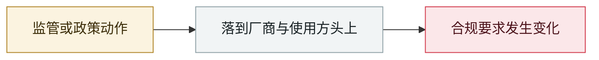

# 美国政府对 Anthropic 发出出口管制指令

US government issues export controls to Anthropic

     

## 概要

美国政府向 Anthropic 发出出口管制指令，限制特定能力等级的模型对部分国家与实体开放——首次把前沿模型的网络能力当作受控物项处理。

## 攻击链

## 详情

档案里**唯一一起「监管直接掐断商用 AI 模型供应」**的事件：

1. Anthropic 06-09 发布 Fable 5（GA）与 Mythos 5（限定给 Glasswing 伙伴）
2. **Amazon 研究员报告了绕过 Fable 5 防护的方法**：诱导其定位多个软件漏洞，其中 1 个生成了可利用性验证代码
3. 美国政府以国家安全权限发出指令，**停止所有外国籍人士访问**，含 Anthropic 自己的外籍员工
4. Anthropic 因无法实时核验国籍，**对全球所有人下线了这两个模型**
5. Anthropic 公开反驳：**Opus 4.8、GPT-5.5、Kimi K2.7 等能力更弱的模型也能找到同样漏洞**，且所有测试过的模型都能生成同等的利用代码，因此该手法**并未暴露 Mythos 级别特有的能力**；并指出若把同一标准推广到全行业，新模型发布将事实上停摆。同时与政府合作训练了分类器，可阻断该手法 **99% 以上**
6. 美国及盟国的经营者与技术人员联署公开信（致商务部长与国家网络总监），称此举**是从防御方手里夺走最好的模型**
7. **06-26** 批准对部分美国组织恢复 Mythos 5 有限供应 → **06-30** 解除出口管制 → **07-01** Fable 5 全球恢复

> **为什么重要**：它把「AI 网络能力属于军民两用管制物项」第一次摆上台面，而结论是 —— **管制在技术上不可执行（无法实时核验国籍），在效果上伤害防御方**。

## 来源

| # | 来源 | 链接 |
|---|---|---|
| 1 | Anthropic 声明 | <https://www.anthropic.com/news/fable-mythos-access> |
| 2 | 公开信 freefable.org | <https://freefable.org/> |
| 3 | Anthropic 恢复公告 | <https://www.anthropic.com/news/redeploying-fable-5> |

## 元数据

| 字段 | 值 |
|---|---|
| 日期 | `2026-06-12`（原文：2026-06-12，精度 `day`） |
| 性质 | 政策 / 监管 `policy` |
| 类型 | [`GOV`](../../../../taxonomy/types.md#gov) 治理 / 监管 |
| 严重度 | **信息** `info` |
| 可信度 | **A** — 一手来源（厂商 / 受害方 / 执法 / 官方报告） |
| 真实伤害 | 不适用 |
| AI 参与 | 已确认 `confirmed` |
| 地区 | [美国](../../../../regions/us.md) |
| 档案编号 | `2026-06-12-anthropic-mei-guo-zheng-fu` |

**判定依据**：政策 / 监管动作，不计入事故统计，`severity` 记为 `info`。 分级口径见 [taxonomy/severity.md](../../../../taxonomy/severity.md) 与 [taxonomy/confidence.md](../../../../taxonomy/confidence.md)。

## 相关

**所属专题**：[防御与治理](../../../../topics/defense.md)

**同类条目**：

- `2026-06-09` [Anthropic Claude Fable 5 GA + Mythos 5 限定](../../../2026-06/2026-06-09-anthropic-claude-fable-ga.md)   Anthropic Claude Fable 5 GA, Mythos 5 limited release
- `2026-06-11` [CISA BOD 26-04](../../../2026-06/2026-06-11-cisa-bod.md)   CISA BOD 26-04
- `2026-06-12` [Google 起诉中国背景的 "Outsider Enterprise" 短信钓鱼网络](../../../2026-06/2026-06-12-google-outsider-enterprise.md)   Google sues the China-linked "Outsider Enterprise" smishing network
- `2026-06-23` [Five Eyes 致企业董事会与高管的联合声明](../../../2026-06/2026-06-23-five-eyes-zhi-qi-ye.md)   Five Eyes joint statement to boards and executives

---

[← English original](../../../2026-06/2026-06-12-anthropic-mei-guo-zheng-fu.md) · [2026-06 index](../../../2026-06/README.md) · [All records](../../../README.md) · [Home](../../../../README.md)

本条目属于 **Orca AI Incident Archive**，按 [CC BY 4.0](../../../../LICENSE) 授权。发现事实错误或缺少来源，请[提 issue 或 PR](../../../../CONTRIBUTING.md)——更正会写进条目的修订记录，不会静默覆盖。
