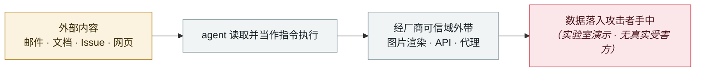

# SearchLeak（CVE-2026-42824）

SearchLeak (CVE-2026-42824)

      

## 概要

Varonis 三段链：① 搜索 URL 的 `q` 参数被当指令 ② 无害化是**生成后的后处理**，流式渲染中的 `` 已先发出请求 ③ CSP 允许 `*.bing.com`，**Bing 图片搜索在服务端抓取指定 URL，浏览器 CSP 管不着**。诱导域名是 microsoft.com，Copilot 以用户权限运行 —— 受害者**点一次链接**即泄露邮件、安全验证码、日历、SharePoint、OneDrive。微软已修复、用户无需操作；Varonis 称微软给了 critical，MSRC 页面基本值 6.5

## 攻击链

## 来源

| # | 来源 | 链接 |
|---|---|---|
| 1 | Varonis | <https://www.varonis.com/blog/searchleak> |
| 2 | MSRC | <https://msrc.microsoft.com/update-guide/vulnerability/CVE-2026-42824> |

## 元数据

| 字段 | 值 |
|---|---|
| 日期 | `2026-06-15`（原文：2026-06-15，精度 `day`） |
| 性质 | 研究演示 `research` |
| 类型 | [`IPI`](../../../../taxonomy/types.md#ipi) 间接提示注入 · [`EXFIL`](../../../../taxonomy/types.md#exfil) 数据外泄 |
| 严重度 | **中** `medium` |
| 可信度 | **A** — 一手来源（厂商 / 受害方 / 执法 / 官方报告） |
| 真实伤害 | 否 |
| AI 参与 | 已确认 `confirmed` |
| 地区 | [全球](../../../../regions/global.md) |
| 档案编号 | `2026-06-15-searchleak` |

**判定依据**：研究机构或厂商的受控演示，`real_harm: false`；收录是为了标记攻击面何时被公开。 判 `medium`：受控演示、中等缺陷，或单用户 / 单机范围的事故。 分级口径见 [taxonomy/severity.md](../../../../taxonomy/severity.md) 与 [taxonomy/confidence.md](../../../../taxonomy/confidence.md)。

## 相关

**所属专题**：[零点击数据外泄链](../../../../topics/zero-click-exfil.md)

**同类条目**：

- `2026-06-01` [黑客直接「请求」Meta AI 客服机器人交出 Instagram 账号](../../../2026-06/2026-06-01-meta-ai-support-bot-hands-over-instagram.md)   Attackers simply ask Meta's AI support bot for Instagram accounts
- `2026-06-12` [Agentjacking：一个公开 DSN 就能劫持 AI 编码 agent](../../../2026-06/2026-06-12-agentjacking-public-dsn.md)   Agentjacking: one public DSN hijacks AI coding agents
- `2026-06-24` [BioShocking：把 agent 先教傻，再让它交出密码](../../../2026-06/2026-06-24-bioshocking-agent-xian-jiao-sha.md)   BioShocking: dumb the agent down first, then take the password
- `2026-06-08` [AgentForger：一条链接伪造出一个「AI 内鬼」](../../../2026-06/2026-06-08-agentforger-yi-tiao-lian-jie.md)   AgentForger: one link forges an "AI insider"

---

[← English original](../../../2026-06/2026-06-15-searchleak.md) · [2026-06 index](../../../2026-06/README.md) · [All records](../../../README.md) · [Home](../../../../README.md)

本条目属于 **Orca AI Incident Archive**，按 [CC BY 4.0](../../../../LICENSE) 授权。发现事实错误或缺少来源，请[提 issue 或 PR](../../../../CONTRIBUTING.md)——更正会写进条目的修订记录，不会静默覆盖。
