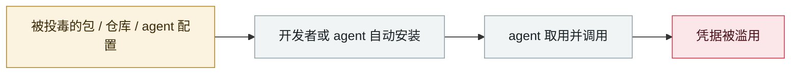

# Sapphire Sleet 88 分钟投毒 Mastra AI 全 scope

Sapphire Sleet poisons every Mastra AI scope in 88 minutes

      

## 概要

朝鲜系 **Sapphire Sleet** 攻陷了 **ehindero** 的 npm 账号 —— 一名 **Mastra 的前贡献者，其发布权限从未被回收**。用该账号在 **88 分钟内**为 `@mastra` scope 下 **144 个包**发布投毒版本，合计周下载量超 **110 万**。

手法：每个投毒版本注入新依赖 **`easy-day-js`**（`dayjs` 的 typosquat），postinstall 钩子在每台 `npm install` 的开发机上触发。攻击者先发布无害「诱饵」版 1.11.21，再发武器化版 1.11.22 投放混淆 dropper。载荷是跨平台信息窃取器，**瞄准 166 个加密货币钱包扩展**，并在开发者工作站与 CI/CD 上开持久后门。

Microsoft 以**高置信度**归因 Sapphire Sleet，依据是基础设施重叠、**与 Axios 行动的手法一致**、以及该组织窃取加密货币换取硬通货的一贯目标

## 攻击链

## 来源

| # | 来源 | 链接 |
|---|---|---|
| 1 | Microsoft | <https://www.microsoft.com/en-us/security/blog/2026/06/17/postinstall-payload-inside-mastra-npm-supply-chain-compromise/> |
| 2 | safedep | <https://safedep.io/mastra-npm-scope-takeover-supply-chain-attack/> |
| 3 | SecurityWeek | <https://www.securityweek.com/north-korean-hackers-blamed-for-mastra-npm-supply-chain-attack/> |

## 元数据

| 字段 | 值 |
|---|---|
| 日期 | `2026-06-17`（原文：2026-06-17，精度 `day`） |
| 性质 | 真实事故 `incident` |
| 类型 | [`SUPPLY`](../../../../taxonomy/types.md#supply) 供应链投毒 · [`CRED`](../../../../taxonomy/types.md#cred) 凭据滥用 |
| 严重度 | **严重** `critical` |
| 可信度 | **A** — 一手来源（厂商 / 受害方 / 执法 / 官方报告） |
| 真实伤害 | 是 |
| AI 参与 | 已确认 `confirmed` |
| 地区 | [全球](../../../../regions/global.md) |
| 档案编号 | `2026-06-17-sapphire-sleet-mastra-88-minutes` |

**判定依据**：真实事故，有确认的受害方。 判 `critical`：确认的真实损害达到多组织 / 政府 / 关键基础设施 / 供应链蠕虫级别，或属首次出现且有真实受害方的能力里程碑。 分级口径见 [taxonomy/severity.md](../../../../taxonomy/severity.md) 与 [taxonomy/confidence.md](../../../../taxonomy/confidence.md)。

## 相关

**所属专题**：[agent 供应链投毒](../../../../topics/agent-supply-chain.md)

**同类条目**：

- `2026-06-01` [Miasma 蠕虫](../../../2026-06/2026-06-01-miasma-worm.md)   Miasma worm
- `2026-06-01` [黑客直接「请求」Meta AI 客服机器人交出 Instagram 账号](../../../2026-06/2026-06-01-meta-ai-support-bot-hands-over-instagram.md)   Attackers simply ask Meta's AI support bot for Instagram accounts
- `2026-06-04` [Claude Oceanus-v1-p 被非法分发](../../../2026-06/2026-06-04-claude-oceanus-fei-fa-fen.md)   Claude Oceanus-v1-p illegally redistributed
- `2026-06-13` [PromptSnatcher：广告拦截扩展偷 AI 对话](../../../2026-06/2026-06-13-promptsnatcher-guang-gao-lan-jie.md)   PromptSnatcher: ad-blocking extensions steal AI conversations

---

[← English original](../../../2026-06/2026-06-17-sapphire-sleet-mastra-88-minutes.md) · [2026-06 index](../../../2026-06/README.md) · [All records](../../../README.md) · [Home](../../../../README.md)

本条目属于 **Orca AI Incident Archive**，按 [CC BY 4.0](../../../../LICENSE) 授权。发现事实错误或缺少来源，请[提 issue 或 PR](../../../../CONTRIBUTING.md)——更正会写进条目的修订记录，不会静默覆盖。
